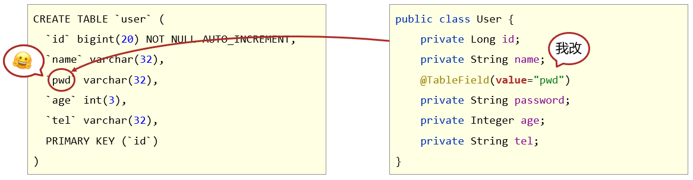
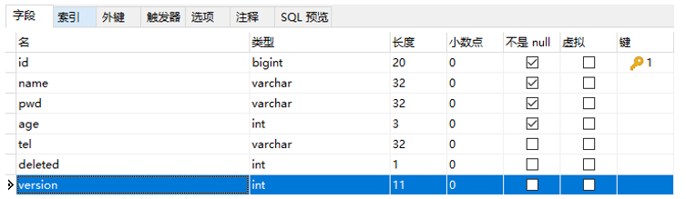

## 学习目标

- [ ] 能够基于MyBatisPlus完成标准Dao开发
- [ ] 能够掌握MyBatisPlus的条件查询
- [ ] 能够掌握MyBatisPlus的字段映射与表名映射
- [ ] 能够掌握id生成策略控制
- [ ] 能够理解代码生成器的相关配置

## 一、MyBatisPlus简介

### 1. 入门案例

#### 问题导入

MyBatisPlus环境搭建的步骤？

#### 1.1 SpringBoot整合MyBatisPlus入门程序

##### ①：创建新模块，选择Spring初始化，并配置模块相关基础信息

#####  ②：选择当前模块需要使用的技术集（仅保留JDBC）

 

##### ③：手动添加MyBatisPlus起步依赖

```xml
<dependency>
    <groupId>com.baomidou</groupId>
    <artifactId>mybatis-plus-boot-starter</artifactId>
    <version>3.4.1</version>
</dependency>
```

注意事项：由于mp并未被收录到idea的系统内置配置，无法直接选择加入

##### ④：设置Jdbc参数（**application.yml**）

```yml
spring:
  datasource:
    type: com.alibaba.druid.pool.DruidDataSource
    driver-class-name: com.mysql.cj.jdbc.Driver
    url: jdbc:mysql://localhost:3306/mybatisplus_db?serverTimezone=UTC
    username: root
    password: root
```

注意事项：如果使用Druid数据源，需要导入对应坐标

```xml
<dependency>
    <groupId>com.alibaba</groupId>
    <artifactId>druid</artifactId>
    <version>1.1.16</version>
</dependency>

<dependency>
    <groupId>mysql</groupId>
    <artifactId>mysql-connector-java</artifactId>
    <scope>runtime</scope>
</dependency>
```

##### ⑤：制作实体类与表结构

（类名与表名对应，属性名与字段名对应）

```sql
CREATE TABLE `user` (
  `id`        bigint(20) NOT NULL AUTO_INCREMENT COMMENT '编号' ,
  `name`      varchar(32) NOT NULL COMMENT '用户名' ,
  `password`  varchar(32) NOT NULL COMMENT '密码' ,
  `age`       int(3) NOT NULL COMMENT '龄年' ,
  `tel`       varchar(32) NOT NULL COMMENT '电话' ,
  PRIMARY KEY (`id`)
);
```

```java
public class User {
    private Long id;
    private String name;
    private String password;
    private Integer age;
    private String tel;
}
```

##### ⑥：定义数据接口，继承**BaseMapper**

```java
package com.itheima.dao;

import com.baomidou.mybatisplus.core.mapper.BaseMapper;
import com.itheima.domain.User;
import org.apache.ibatis.annotations.Mapper;

@Mapper
public interface UserDao extends BaseMapper<User> {
}

```

##### ⑦：测试类中注入dao接口，测试功能

```java
package com.itheima;

import com.itheima.dao.UserDao;
import com.itheima.domain.User;
import org.junit.jupiter.api.Test;
import org.springframework.beans.factory.annotation.Autowired;
import org.springframework.boot.test.context.SpringBootTest;

import java.util.List;

@SpringBootTest
public class Mybatisplus01QuickstartApplicationTests {

    @Autowired
    private UserDao userDao;

    @Test
    void testGetAll() {
        List<User> userList = userDao.selectList(null);
        System.out.println(userList);
    }
}
```


#### 1.2 练习：MyBatisPlus入门练习

题目：加载MyBatisPlus_Ex1模块，使用MyBatisPlus技术完成程序书写并基于JUnit测试程序执行查询全部数据的功能

- 说明：

    ​	①：创建数据库mp_db，加载mybatisplus.sql文件，初始化表结构与数据

    ​	②：dao接口已定义完毕，请将其设定为基于MyBatisPlus开发的数据层接口（提示：继承，添加注解）

    ​	③：测试类已定义完毕，请注入数据层接口并测试查询全部功能（提示：selectList方法）


### 2. MyBatisPlus概述

#### 问题导入

通过入门案例制作，MyBatisPlus的优点有哪些？

#### 2.1 MyBatis介绍

- MyBatisPlus（简称MP）是基于MyBatis框架基础上开发的增强型工具，旨在简化开发、提高效率

- 官网：[https](https://mybatis.plus/)[://mybatis.plus](https://mybatis.plus/)[/](https://mybatis.plus/)   [https://mp.baomidou.com](https://mp.baomidou.com/)[/](https://mp.baomidou.com/)

#### 2.2 MyBatisPlus特性

- 无侵入：只做增强不做改变，不会对现有工程产生影响
- 强大的 CRUD 操作：内置通用 Mapper，少量配置即可实现单表CRUD 操作
- 支持 Lambda：编写查询条件无需担心字段写错
- 支持主键自动生成
- 内置分页插件
- ……


## 二、标准数据层开发

### 1. MyBatisPlus的CRUD操作

 

```java
package com.itheima;

import com.itheima.dao.UserDao;
import com.itheima.domain.User;
import org.junit.jupiter.api.Test;
import org.springframework.beans.factory.annotation.Autowired;
import org.springframework.boot.test.context.SpringBootTest;

import java.util.List;

@SpringBootTest
class Mybatisplus01QuickstartApplicationTests {

    @Autowired
    private UserDao userDao;

    @Test
    void testSave() {
        User user = new User();
        user.setName("黑马程序员");
        user.setPassword("itheima");
        user.setAge(12);
        user.setTel("4006184000");
        userDao.insert(user);
    }

    @Test
    void testDelete() {
        userDao.deleteById(1401856123725713409L);
    }

    @Test
    void testUpdate() {
        User user = new User();
        user.setId(1L);
        user.setName("Tom888");
        user.setPassword("tom888");
        userDao.updateById(user);
    }

    @Test
    void testGetById() {
        User user = userDao.selectById(2L);
        System.out.println(user);
    }


    @Test
    void testGetAll() {
        List<User> userList = userDao.selectList(null);
        System.out.println(userList);
    }
}

```


### 2. Lombok插件介绍

#### 问题导入

有什么简单的办法可以自动生成实体类的GET、SET方法？

- Lombok，一个Java类库，提供了一组注解，简化POJO实体类开发。


```xml
<dependency>
    <groupId>org.projectlombok</groupId>
    <artifactId>lombok</artifactId>
    <version>1.18.12</version>
</dependency>
```

- 常用注解：==@Data==，为当前实体类在编译期设置对应的get/set方法，无参/无参构造方法，toString方法，hashCode方法，equals方法等


```java
package com.itheima.domain;

import lombok.*;

//lombok
@Data
public class User {
    private Long id;
    private String name;
    private String password;
    private Integer age;
    private String tel;
}

```

### 3. MyBatisPlus分页功能

#### 问题导入

思考一下Mybatis分页插件是如何用的？

#### 3.1 分页功能接口


#### 3.2 MyBatisPlus分页使用

**①：设置分页拦截器作为Spring管理的bean**

```java
package com.itheima.config;

import com.baomidou.mybatisplus.extension.plugins.MybatisPlusInterceptor;
import com.baomidou.mybatisplus.extension.plugins.inner.PaginationInnerInterceptor;
import org.springframework.context.annotation.Bean;
import org.springframework.context.annotation.Configuration;

@Configuration
public class MpConfig {
    @Bean
    public MybatisPlusInterceptor mpInterceptor(){
        //1.定义Mp拦截器
        MybatisPlusInterceptor mpInterceptor = new MybatisPlusInterceptor();
        //2.添加具体的拦截器
        mpInterceptor.addInnerInterceptor(new PaginationInnerInterceptor());
        return mpInterceptor;
    }
}

```

**②：执行分页查询**

```java
@Test
void testGetByPage(){
    //IPage对象封装了分页操作相关的数据
    IPage page  = new Page(2,3);
    userDao.selectPage(page,null);
    System.out.println("当前页码值："+page.getCurrent());
    System.out.println("每页显示数："+page.getSize());
    System.out.println("一共多少页："+page.getPages());
    System.out.println("一共多少条数据："+page.getTotal());
    System.out.println("数据："+page.getRecords());
}
```

#### 3.3 开启MyBatisPlus日志

```yml
spring:
  datasource:
    type: com.alibaba.druid.pool.DruidDataSource
    driver-class-name: com.mysql.cj.jdbc.Driver
    url: jdbc:mysql://localhost:3306/mybatisplus_db?serverTimezone=UTC
    username: root
    password: root
# 开启mp的日志（输出到控制台）
mybatis-plus:
  configuration:
    log-impl: org.apache.ibatis.logging.stdout.StdOutImpl
```

#### 3.4 练习：数据层标准接口开发练习

题目：基于MyBatisPlus_Ex1模块，完成6个基础接口的测试工作（新增，删除，修改，按id查询，查询全部，分页查询）

- 说明：

    ​	①：新增、修改操作对应的数据需要手工创建（提示：修改操作对应数据id必须存在）

    ​	②：分页功能基于拦截器实现，请加载分页功能对应的拦截器bean

     				提示1：MybatisPlusInterceptor
 	
     				提示2：PaginationInnerInterceptor

    ​	③：分页查询的结果封装在IPage对象中


## 三、DQL编程控制

### 1. 条件查询方式

- MyBatisPlus将书写复杂的SQL查询条件进行了封装，使用编程的形式完成查询条件的组合


#### 1.1 条件查询

##### 1.1.1 方式一：按条件查询

```java
//方式一：按条件查询
QueryWrapper qw = new QueryWrapper();
qw.lt("age", 18);
List<User> userList = userDao.selectList(qw);
System.out.println(userList);
```

##### 1.1.2 方式二：lambda格式按条件查询（推荐）

```java
//方式二：lambda格式按条件查询
QueryWrapper<User> qw = new QueryWrapper<User>();
qw.lambda().lt(User::getAge, 10);
List<User> userList = userDao.selectList(qw);
System.out.println(userList);
```

##### 1.1.3 方式三：lambda格式按条件查询

```java
//方式三：lambda格式按条件查询
LambdaQueryWrapper<User> lqw = new LambdaQueryWrapper<User>();
lqw.lt(User::getAge, 10);
List<User> userList = userDao.selectList(lqw);
System.out.println(userList);
```

#### 1.2 组合条件

##### 1.2.1 并且关系（and）

```java
//并且关系
LambdaQueryWrapper<User> lqw = new LambdaQueryWrapper<User>();
//并且关系：10到30岁之间
lqw.lt(User::getAge, 30).gt(User::getAge, 10);
List<User> userList = userDao.selectList(lqw);
System.out.println(userList);
```

##### 1.2.2 或者关系（or）

```java
//或者关系
LambdaQueryWrapper<User> lqw = new LambdaQueryWrapper<User>();
//或者关系：小于10岁或者大于30岁
lqw.lt(User::getAge, 10).or().gt(User::getAge, 30);
List<User> userList = userDao.selectList(lqw);
System.out.println(userList);
```

#### 1.3 NULL值处理

##### 问题导入

如下搜索场景，在多条件查询中，有条件的值为空应该怎么解决？


#####  1.3.1 if语句控制条件追加

```java
LambdaQueryWrapper<User> lqw = new LambdaQueryWrapper<User>();
lqw.lt(User::getAge, uq.getAge2());
if (null != uq.getAge()) {
    lqw.gt(User::getAge, uq.getAge());
}
List<User> userList = userDao.selectList(lqw);
System.out.println(userList);
```

##### 1.3.2 条件参数控制

```java
LambdaQueryWrapper<User> lqw = new LambdaQueryWrapper<User>();
//先判定第一个参数是否为true，如果为true连接当前条件
lqw.lt(null != uq.getAge2(), User::getAge, uq.getAge2());
lqw.gt(null != uq.getAge(), User::getAge, uq.getAge());

List<User> userList = userDao.selectList(lqw);
System.out.println(userList);
```

##### 1.3.3 条件参数控制（链式编程）

```java
LambdaQueryWrapper<User> lqw = new LambdaQueryWrapper<User>();
//先判定第一个参数是否为true，如果为true连接当前条件
lqw.lt(null != uq.getAge2(), User::getAge, uq.getAge2())
        .gt(null != uq.getAge(), User::getAge, uq.getAge());

List<User> userList = userDao.selectList(lqw);
System.out.println(userList);
```


### 2. 查询投影


#### 2.1 查询结果包含模型类中部分属性

```java
LambdaQueryWrapper<User> lqw = new LambdaQueryWrapper<User>();
lqw.select(User::getId, User::getName, User::getAge);
QueryWrapper<User> lqw = new QueryWrapper<User>();
lqw.select("id", "name", "age", "tel");
List<User> userList = userDao.selectList(lqw);
System.out.println(userList);
```

#### 2.2 查询结果包含模型类中未定义的属性

```java
QueryWrapper<User> lqw = new QueryWrapper<User>();
lqw.select("count(*) as count, tel");
lqw.groupBy("tel");
List<Map<String, Object>> userList = userDao.selectMaps(lqw);
System.out.println(userList);
```

### 3. 查询条件设定

#### 问题导入

多条件查询有哪些组合？

- 范围匹配（> 、 = 、between）
- 模糊匹配（like）
- 空判定（null）
- 包含性匹配（in）
- 分组（group）
- 排序（order）
- ……

#### 3.1 查询条件

- 用户登录（eq匹配）

```java
LambdaQueryWrapper<User> lqw = new LambdaQueryWrapper<User>();
//等同于=
lqw.eq(User::getName, "Jerry").eq(User::getPassword, "jerry");
User loginUser = userDao.selectOne(lqw);
System.out.println(loginUser);
```

- 购物设定价格区间、户籍设定年龄区间（le ge匹配 或 between匹配）

```java
LambdaQueryWrapper<User> lqw = new LambdaQueryWrapper<User>();
//范围查询 lt le gt ge eq between
lqw.between(User::getAge, 10, 30);
List<User> userList = userDao.selectList(lqw);
System.out.println(userList);
```

- 查信息，搜索新闻（非全文检索版：like匹配）

```java
LambdaQueryWrapper<User> lqw = new LambdaQueryWrapper<User>();
//模糊匹配 like
lqw.likeLeft(User::getName, "J");
List<User> userList = userDao.selectList(lqw);
System.out.println(userList);
```

- 统计报表（分组查询聚合函数）

```java
QueryWrapper<User> qw = new QueryWrapper<User>();
qw.select("gender","count(*) as nums");
qw.groupBy("gender");
List<Map<String, Object>> maps = userDao.selectMaps(qw);
System.out.println(maps);
```

#### 3.2 查询API

- 更多查询条件设置参看 [https://mybatis.plus/guide/wrapper.html#abstractwrapper](https://mybatis.plus/guide/wrapper.html)

#### 3.3 练习：MyBatisPlus练习

题目：基于MyBatisPlus_Ex1模块，完成Top5功能的开发。

- 说明：

    ①：Top5指根据销售量排序（提示：对销售量进行降序排序）

    ②：Top5是仅获取前5条数据（提示：使用分页功能控制数据显示数量）

### 4. 字段映射与表名映射

#### 问题导入

思考表的字段和实体类的属性不对应，查询会怎么样？

#### 4.1 问题一：表字段与编码属性设计不同步

- 在模型类属性上方，使用**@TableField**属性注解，通过==**value**==属性，设置当前属性对应的数据库表中的字段关系。




#### 4.2 问题二：编码中添加了数据库中未定义的属性

- 在模型类属性上方，使用**@TableField**注解，通过**==exist==**属性，设置属性在数据库表字段中是否存在，默认为true。此属性无法与value合并使用。


#### 4.3 问题三：采用默认查询开放了更多的字段查看权限

- 在模型类属性上方，使用**@TableField**注解，通过**==select==**属性：设置该属性是否参与查询。此属性与select()映射配置不冲突。

 

#### 4.4 问题四：表名与编码开发设计不同步

- 在<u>**模型类**</u>上方，使用**@TableName**注解，通过**==value==**属性，设置当前类对应的数据库表名称。


## 四、DML编程控制

### 1. id生成策略控制（Insert）

#### 问题导入

主键生成的策略有哪几种方式？

不同的表应用不同的id生成策略

- 日志：自增（1,2,3,4，……）
- 购物订单：特殊规则（FQ23948AK3843）
- 外卖单：关联地区日期等信息（10 04 20200314 34 91）
- 关系表：可省略id
- ……

#### 1.1 id生成策略控制（@TableId注解）

- 名称：@TableId

- 类型：**属性注解**

- 位置：模型类中用于表示主键的属性定义上方

- 作用：设置当前类中主键属性的生成策略

- 相关属性

    ​	**type**：设置主键属性的生成策略，值参照IdType枚举值

     

#### 1.2 全局策略配置

```yml
mybatis-plus:
  global-config:
    db-config:
      id-type: assign_id
      table-prefix: tbl_
```

##### id生成策略全局配置


##### 表名前缀全局配置


### 2. 多记录操作（Delete/Select）

#### 问题导入

MyBatisPlus是否支持批量操作？

 

#### 2.1 按照主键删除多条记录

```java
//删除指定多条数据
List<Long> list = new ArrayList<>();
list.add(1402551342481838081L);
list.add(1402553134049501186L);
list.add(1402553619611430913L);

userDao.deleteBatchIds(list);
```

#### 2.2 根据主键查询多条记录

```java
//查询指定多条数据
List<Long> list = new ArrayList<>();
list.add(1L);
list.add(3L);
list.add(4L);
userDao.selectBatchIds(list);
```

### 3. 逻辑删除（Delete/Update）

#### 问题导入

在实际环境中，如果想删除一条数据，是否会真的从数据库中删除该条数据？

- 删除操作业务问题：业务数据从数据库中丢弃

- 逻辑删除：为数据设置是否可用状态字段，删除时设置状态字段为不可用状态，数据保留在数据库中

 

#### 3.1 逻辑删除案例

##### ①：数据库表中添加逻辑删除标记字段

 

##### ②：实体类中添加对应字段，并设定当前字段为逻辑删除标记字段

```java
package com.itheima.domain;

import com.baomidou.mybatisplus.annotation.*;

import lombok.Data;

@Data
public class User {

    private Long id;
    
    //逻辑删除字段，标记当前记录是否被删除
    @TableLogic
    private Integer deleted;
    
}
```

##### ③：配置逻辑删除字面值

```yml
mybatis-plus:
  global-config:
    db-config:
      table-prefix: tbl_
      # 逻辑删除字段名
      logic-delete-field: deleted
      # 逻辑删除字面值：未删除为0
      logic-not-delete-value: 0
      # 逻辑删除字面值：删除为1
      logic-delete-value: 1
```

 

### 4. 乐观锁（Update）

#### 问题导入

乐观锁主张的思想是什么？

- 业务并发现象带来的问题：秒杀

 

#### 4.1 乐观锁案例

##### ①：数据库表中添加锁标记字段

 

##### ②：实体类中添加对应字段，并设定当前字段为逻辑删除标记字段

```java
package com.itheima.domain;

import com.baomidou.mybatisplus.annotation.TableField;
import com.baomidou.mybatisplus.annotation.TableLogic;
import com.baomidou.mybatisplus.annotation.Version;
import lombok.Data;

@Data
public class User {

	private Long id;
	
    @Version
    private Integer version;
}

```

##### ③：配置乐观锁拦截器实现锁机制对应的动态SQL语句拼装

```java
package com.itheima.config;

import com.baomidou.mybatisplus.extension.plugins.MybatisPlusInterceptor;
import com.baomidou.mybatisplus.extension.plugins.inner.OptimisticLockerInnerInterceptor;
import com.baomidou.mybatisplus.extension.plugins.inner.PaginationInnerInterceptor;
import org.springframework.context.annotation.Bean;
import org.springframework.context.annotation.Configuration;

@Configuration
public class MpConfig {
    @Bean
    public MybatisPlusInterceptor mpInterceptor() {
        //1.定义Mp拦截器
        MybatisPlusInterceptor mpInterceptor = new MybatisPlusInterceptor();

        //2.添加乐观锁拦截器
        mpInterceptor.addInnerInterceptor(new OptimisticLockerInnerInterceptor());
        return mpInterceptor;
    }
}

```

##### ④：使用乐观锁机制在修改前必须先获取到对应数据的verion方可正常进行

```java
@Test
public void testUpdate() {
    User user = new User();
    user.setId(3L);
    user.setName("Jock666");
    user.setVersion(1);
    userDao.updateById(user);
    
    //1.先通过要修改的数据id将当前数据查询出来
    User user = userDao.selectById(3L);
    //2.将要修改的属性逐一设置进去
    user.setName("Jock888");
    userDao.updateById(user);
    
    //1.先通过要修改的数据id将当前数据查询出来
    User user = userDao.selectById(3L);     //version=3
    User user2 = userDao.selectById(3L);    //version=3
    user2.setName("Jock aaa");
    userDao.updateById(user2);              //version=>4
    user.setName("Jock bbb");
    userDao.updateById(user);               //verion=3?条件还成立吗？
}
```

 

## 五、快速开发-代码生成器

### 问题导入

如果只给一张表的字段信息，能够推演出Domain、Dao层的代码？

### 1. MyBatisPlus提供模板

- Mapper接口模板


- 实体对象类模板


### 2. 数据库相关配置

- 第一步：创建代码生成器对象，执行生成代码操作
- 第二步：数据源相关配置：读取数据库中的信息，根据数据库表结构生成代码
- 第三步：执行生成操作

```java
package com.itheima;

import com.baomidou.mybatisplus.generator.AutoGenerator;
import com.baomidou.mybatisplus.generator.config.DataSourceConfig;

public class Generator {
    public static void main(String[] args) {
        //1. 创建代码生成器对象，执行生成代码操作
        AutoGenerator autoGenerator = new AutoGenerator();

        //2. 数据源相关配置：读取数据库中的信息，根据数据库表结构生成代码
        DataSourceConfig dataSource = new DataSourceConfig();
        dataSource.setDriverName("com.mysql.cj.jdbc.Driver");
        dataSource.setUrl("jdbc:mysql://localhost:3306/mybatisplus_db?serverTimezone=UTC");
        dataSource.setUsername("root");
        dataSource.setPassword("root");
        autoGenerator.setDataSource(dataSource);

         //3. 执行生成操作
        autoGenerator.execute();
    }
}

```

### 3. 开发者自定义配置

- 设置全局配置

```java
//设置全局配置
GlobalConfig globalConfig = new GlobalConfig();
globalConfig.setOutputDir(System.getProperty("user.dir")+"/mybatisplus_04_generator/src/main/java");    //设置代码生成位置
globalConfig.setOpen(false);    //设置生成完毕后是否打开生成代码所在的目录
globalConfig.setAuthor("黑马程序员");    //设置作者
globalConfig.setFileOverride(true);     //设置是否覆盖原始生成的文件
globalConfig.setMapperName("%sDao");    //设置数据层接口名，%s为占位符，指代模块名称
globalConfig.setIdType(IdType.ASSIGN_ID);   //设置Id生成策略
autoGenerator.setGlobalConfig(globalConfig);
```

- 设置包名相关配置

```java
//设置包名相关配置
PackageConfig packageInfo = new PackageConfig();
packageInfo.setParent("com.aaa");   //设置生成的包名，与代码所在位置不冲突，二者叠加组成完整路径
packageInfo.setEntity("domain");    //设置实体类包名
packageInfo.setMapper("dao");   //设置数据层包名
autoGenerator.setPackageInfo(packageInfo);
```

- 策略设置

```java
//策略设置
StrategyConfig strategyConfig = new StrategyConfig();
strategyConfig.setInclude("tbl_user");  //设置当前参与生成的表名，参数为可变参数
strategyConfig.setTablePrefix("tbl_");  //设置数据库表的前缀名称，模块名 = 数据库表名 - 前缀名  例如： User = tbl_user - tbl_
strategyConfig.setRestControllerStyle(true);    //设置是否启用Rest风格
strategyConfig.setVersionFieldName("version");  //设置乐观锁字段名
strategyConfig.setLogicDeleteFieldName("deleted");  //设置逻辑删除字段名
strategyConfig.setEntityLombokModel(true);  //设置是否启用lombok
autoGenerator.setStrategy(strategyConfig);
```

