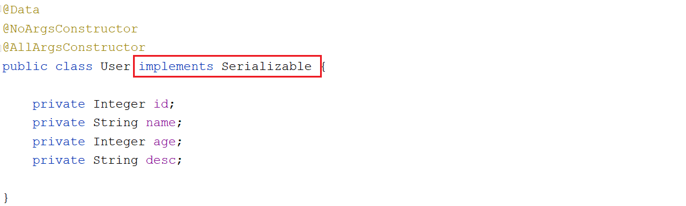

# Redis基础

## 课程内容

- Redis简介
- 数据类型
- 常用指令
- Jedis
- 持久化


## 1. Redis 简介

### 1.1 NoSQL概念

**1). 概念**

NoSQL：即 Not-Only SQL（ 泛指非关系型的数据库），作为关系型数据库的补充。 作用：应对基于海量用户和海量数据前提下的数据处理问题。

他说这句话说的非常客气，什么意思呢？就是我们数据存储要用SQL，但是呢可以不仅仅用SQL，还可以用别的东西，那别的东西叫什么呢？于是他定义了一句话叫做NoSQL。这个意思就是说我们存储数据，可以不光使用SQL，我们还可以使用非SQL的这种存储方案，这就是所谓的NoSQL。


**2). 特征**

可扩容，可伸缩。SQL数据关系过于复杂，扩容一下难度很高，那我们Nosql 这种的，不存关系，所以它的扩容就简单一些。

大数据量下高性能。包数据非常多的时候，它的性能高，因为你不走磁盘IO，你走的是内存，性能肯定要比磁盘IO的性能快一些。

灵活的数据模型、高可用。他设计了自己的一些数据存储格式，这样能保证效率上来说是比较高的，最后一个高可用，我们等到集群内部分再去它！


**3).常见 Nosql 数据库**

目前市面上常见的Nosql产品：Redis、memcache、HBase、MongoDB


### 1.2 Redis概念

 


#### 1.2.1 redis概念

概念：Redis 是用 C 语言开发的一个开源的高性能键值对（key-value）数据库。

特征：

1). 数据间没有必然的关联关系；

2). 内部采用单线程机制进行工作；

3). 高性能。官方提供测试数据，50个并发执行100000 个请求,读的速度是110000 次/s,写的速度是81000次/s。

4). 多数据类型支持

​	字符串类型(string)  

​	列表类型(list)

​	散列类型(hash)

​	集合类型(set)

​	有序集合类型(zset/sorted_set)

5). 支持持久化，可以进行数据灾难恢复


#### 1.2.2 redis的应用场景

1). 为热点数据加速查询（主要场景）。如热点商品、热点新闻、热点资讯、推广类等高访问量信息等。

2). 即时信息查询。如各位排行榜、各类网站访问统计、公交到站信息、在线人数信息（聊天室、网站）、设备信号等。

3). 时效性信息控制。如验证码控制、投票控制等。

4). 分布式数据共享。如分布式集群架构中的 session 分离。

5). 消息队列。


### 1.3 Redis安装与启动

#### 1.3.1 Redis安装

本课程所示，均基于CenterOS7安装Redis。

1). 上传redis的安装包redis-4.0.14.tar.gz到Linux系统 /root目录下

 


2). 准备C语言编译环境

```
yum install gcc
```


3). 安装Redis

```
A. 切换目录/root
cd /root

B. 解压
tar -zxvf redis-4.0.14.tar.gz 
cd redis-4.0.14

C. 编译C语言源码
make

D. 安装
make install PREFIX=/usr/local/redis

E. 进入安装目录, 拷贝redis配置文件
cd /usr/local/redis/
ll
cp /root/redis-4.0.14/redis.conf .
```

 


#### 1.3.2 redis目录及文件

| 指令/文件            | 描述                              |
| -------------------- | --------------------------------- |
| bin/redis-server     | 服务器启动命令                    |
| bin/redis-cli        | 客户端启动命令                    |
| bin/redis-check-dump | RDB文件检查工具（快照持久化文件） |
| bin/redis-check-aof  | AOF文件修复工具                   |
| redis.conf           | redis核心配置文件                 |


#### 1.3.3 Redis服务器启动

```bash
cd /usr/local/redis/

bin/redis-server redis.conf
```

 


#### 1.3.4 Redis客户端启动

启动客户端

```bash
redis-cli [-h host] [-p port]
```


示例: 

```bash
cd /usr/local/redis/

A. 连接指定IP, 指定端口号的redis
bin/redis-cli –h 192.168.200.200 –p 6379

B. 连接本地默认端口redis
bin/redis-cli
```

 


### 1.4 服务器端配置

**1). 设置服务器以守护进程的方式运行，开启后服务器控制台中将打印服务器运行信息（同日志内容相同）**

```bash
daemonize yes|no
```

no : 代表以非守护进程方式运行, 启动之后会占用窗口 ;

yes : 代表以守护进程方式运行, 后台运行, 不占用前端窗口 ;

==注意: 设置为yes之后，重新启动，就不会占用前端窗口了；==


**2). 绑定主机地址**

```bash
bind 127.0.0.1
```

如果绑定的是127.0.0.1,代表只能本机访问 ; 如果所有的IP都可以访问, 需要修改为 0.0.0.0


3). 设置服务器端口

```bash
port 6379
```


4). 设置服务器文件保存地址

```bash
dir path
```


## 2. 数据类型

### 2.1  数据类型介绍

#### 2.1.1  Redis数据类型

| 数据类型  | 含义         | 特点                         |
| --------- | ------------ | ---------------------------- |
| string    | 字符串类型   |                              |
| hash      | 哈希类型     | map格式                      |
| list      | 列表类型     | linkedlist格式。支持重复元素 |
| set       | 集合类型     | 不允许重复元素               |
| sortedSet | 有序集合类型 | 不允许重复元素，且元素有顺序 |


#### 2.1.2 结构说明

在学习数据类型之前，我们先要明白数据类型到底是修饰什么的。我们知道redis自身是一个 Map，其中所有的数据都是采用 key : value 的形式存储。

对于这种结构来说，我们用来存储数据一定是一个值前面对应一个名称。我们通过名称来访问后面的值。按照这种形势，我们可以对出来我们的存储格式。前面这一部分我们称为key。后面的一部分称为value，而我们的数据类型，他一定是修饰value的。

数据类型指的是存储的数据的类型，也就是 value 部分的类型，key 部分永远都是字符串。


### 2.2  string数据类型操作

#### 2.2.1 string类型

string类型中, value存储的就是字符串数据 。

 


#### 2.2.2 string基本操作

**1). 基础指令**

①. 添加/修改数据

```
set key value
```


②. 获取数据

```
get key
```


③. 删除数据

```
del key
```


④. 判定性添加数据(如果key不存在,则创建)

```
setnx key value
```


⑤. 添加/修改多个数据

```
mset key1 value1 key2 value2 …
```


⑥. 获取多个数据

```
mget key1 key2 …
```


⑦. 追加信息到原始信息后部（如果原始信息存在就追加，否则新建）

```
append key value
```


⑧. 设置过期时间

```
setex key seconds value
```


**2). 拓展指令**

①. 设置数值数据增加/减少

```
incr key
incrby key increment
```


②. 设置数值数据减少

```
decr key
decrby key increment
```


> 如： 
>
> ​	set count 1 
>
> ​	incr count ---------> 自增操作, 每次增加1
>
> ​	incr count 2 -------> 自增操作, 每次增加2
>
> ​	
>
> ​	incr num -----------> 如果num这个key不存在, 默认从0开始自增


### 2.3  hash数据类型操作

#### 2.3.1  hash类型

hash类型：底层使用哈希表结构实现数据存储

 


#### 2.3.2 hash基本操作

**1). 基本操作**

①. 添加/修改数据

```bash
hset key field value
```


②. 获取数据

```bash
hget key field
```


③. 删除数据

```bash
hdel key field1 [field2]
```


④. 添加/修改多个数据

```bash
hmset key field1 value1 field2 value2 …
```


⑤. 获取多个数据

```bash
hmget key field1 field2 …
```


⑥. 获取哈希表中字段的数量

```bash
hlen key
```


⑦. 获取哈希表中是否存在指定的字段

```bash
hexists key field
```


**2).拓展操作**

①. 获取哈希表中所有的字段名

```
hkeys key
```


②. 获取哈希表中所有的字段值

```
hvals key
```


③. 一次性获取所有键值对

```
hgetall key
```


### 2.4  list数据类型操作

前面我们存数据的时候呢，单个数据也能存，多个数据也能存，但是这里面有一个问题，我们存多个数据用hash的时候它是没有顺序的。我们平时操作，实际上数据很多情况下都是有顺序的，那有没有一种能够用来存储带有顺序的这种数据模型呢，list就专门来干这事儿。


#### 2.4.1  list类型

 

Redis的List数据类型是一个双向链表结构。Redis列表是简单的字符串列表，按照插入顺序排序。你可以添加一个元素到列表的头部（左边）或者尾部（右边）一个列表最多可以包含 2^32 - 1 个元素。


> 特点: 
>
> ​	有序 , 可以重复 ;


#### 2.4.2 list基本操作

①. 将元素加入列表左边

```bash
lpush key value1 [value2] ……
```


②. 将元素加入列表左边

```
rpush key value1 [value2] ……
```


③. 范围获取数据

```bash
lrange key start stop
```


④. 获取指定索引的元素

```
lindex key index
```


⑤. 获取元素个数

```
llen key
```


⑥. 删除列表最左边的元素，并将元素返回

```bash
lpop key
```


⑦. 删除列表最右边的元素，并将元素返回

```
rpop key
```


### 2.5  set数据类型操作

#### 2.5.1 set类型

我们现在要存储大量的数据，并且要求提高它的查询效率。用list这种链表形式，它的查询效率是不高的，那怎么办呢？这时候我们就想，有没有高效的存储机制。其实前面咱讲Java的时候说过hash表的结构就非常的好，但是这里边我们已经有hash了，他做了这么一个设定，干嘛呢，他把hash的存储空间给改一下，右边你原来存数据改掉,全部存空，那你说数据放哪儿了？放到原来的filed的位置，也就在这里边存真正的值，那么这个模型就是我们的set 模型。

set类型：与hash存储结构完全相同，仅存储键，不存储值（nil），并且值是不允许重复的。

看一下它的整个结构：

 

> 特点: 
>
> ​	无序 ; 不可重复 ;


#### 2.5.2 set基本操作

**1). 基础操作**

①. 添加数据

```bash
sadd key member1 [member2]
```


②. 获取全部数据

```bash
smembers key
```


③. 删除数据

```bash
srem key member1 [member2]
```


④. 获取集合数据总量

```bash
scard key
```


⑤. 判断集合中是否包含指定数据

```bash
sismember key member
```


⑥. 随机获取集合中指定数量的数据

```bash
srandmember key [count]
```


⑦. 随机获取集中的某个数据并将该数据移除集合

```bash
spop key [count]
```


**2). 拓展操作**

①. 求两个集合的交、并、差集

```
sinter key1 [key2 …]  
sunion key1 [key2 …]  
sdiff key1 [key2 …]
```


②. 求两个集合的交、并、差集并存储到指定集合中

```
sinterstore destination key1 [key2 …]  
sunionstore destination key1 [key2 …]  
sdiffstore destination key1 [key2 …]
```


通过下面一张图回忆一下交、并、差 

 


### 2.6 zset数据类型操作

#### 2.6.1 zset类型

zset，也叫sortedSet ， 是一个有序集合，而set是无序的，zset怎么做到有序的呢？Redis 有序集合和集合一样也是 string 类型元素的集合,且不允许重复的成员。不同的是每个元素都会关联一个 double 类型的分数。redis 正是通过分数来为集合中的成员进行从小到大的排序。有序集合的成员是唯一的,但分数(score)却可以重复。


#### 2.6.2 zset基本操作

①. 添加元素

```
ZADD key score member [[score member]  ...] 
```


②. 获取元素个数

```
ZCARD key
```


③. 获取指定分数范围内的元素

分数从小到大排

```
ZRANGE key start end [WITHSCORES]
```

分数从大到小排

```
ZREVRANGE key start end [WITHSCORES]
```


④. 删除指定元素

```
zrem key value
```


## 3. 常用指令

### 3.1  key基本操作

删除指定key

```bash
del key
```


获取key是否存在

```bash
exists key
```


获取key的类型

```bash
type key
```


为指定key设置有效期

```bash
expire key seconds
```


获取key的有效时间

```bash
ttl key
```


切换key从时效性转换为永久性

```bash
persist key
```


查询key

```bash
keys pattern
```

查询模式规则: 

*: 匹配任意数量的任意符号      

?: 配合一个任意符号


### 3.3  数据库指令

redis为每个服务提供有16个数据库，编号从0到15，每个数据库之间的数据相互独立，在对应的数据库中划出一块区域，说他就是几，你就用几那块，同时，其他的这些都可以进行定义，一共是16个，这里边需要注意一点，他们这16个共用redis的内存。没有说谁大谁小，也就是说数字只是代表了一块儿区域，区域具体多大未知。这是数据库的一个分区的一个策略！


①. 切换数据库

```
select index
```


②. 心跳测试

```
ping
```


③. 数据总量

```
dbsize
```


④. 数据清除

```
flushdb  : 清空当前数据库
flushall : 清空所有数据库
```


## 4. 应用程序操作Redis

### 4.1  Jedis

#### 4.1.1 jedis介绍

一款java操作redis数据库的工具


#### 4.1.2 jedis入门

1). pom.xml 引入依赖

```xml
<dependencies>
    <dependency>
        <groupId>redis.clients</groupId>
        <artifactId>jedis</artifactId>
        <version>2.9.0</version>
    </dependency>

    <dependency>
        <groupId>junit</groupId>
        <artifactId>junit</artifactId>
        <version>4.12</version>
        <scope>test</scope>
    </dependency>
</dependencies>
```


2). 构建jedis对象

连接redis

```
Jedis jedis = new Jedis("localhost", 6379);
```


3). 代码实现

创建：com.itheima.redis.JedisDemo

```java
import org.junit.Test;
import redis.clients.jedis.Jedis;

import java.util.List;
import java.util.Set;

public class JedisDemo {

    //测试string数据类型
    @Test
    public void testString(){
        //1. 获取连接对象Jedis
        Jedis jedis = new Jedis("192.168.200.200",6379);

        //2. 执行操作 ---> 与讲解的指令一一对应
        jedis.set("name","itcast");
        jedis.append("name","-is-very-good");
        String name = jedis.get("name");

        System.out.println(name);
        jedis.close();
    }


    //测试Hash数据类型
    @Test
    public void testHash(){
        //1. 获取连接对象Jedis
        Jedis jedis = new Jedis("192.168.200.200",6379);

        //2. 执行操作 ---> 与讲解的指令一一对应
        jedis.hset("user","name","itcast");
        jedis.hset("user","age","14");

        String age = jedis.hget("user", "age");
        System.out.println(age);
        jedis.close();
    }


    //测试List数据类型
    @Test
    public void testList(){
        //1. 获取连接对象Jedis
        Jedis jedis = new Jedis("192.168.200.200",6379);

        //2. 执行操作 ---> 与讲解的指令一一对应
        jedis.lpush("names","Tom","Cat","Jerry","Lucy","Lee");
        List<String> names = jedis.lrange("names", 0, -1);
        for (String name : names) {
            System.out.println(name);
        }

        jedis.close();
    }


    //测试Set数据类型
    @Test
    public void testSet(){
        //1. 获取连接对象Jedis
        Jedis jedis = new Jedis("192.168.200.200",6379);

        //2. 执行操作 ---> 与讲解的指令一一对应
        jedis.sadd("dev","java","c","php",".Net","go","java");
        Set<String> members = jedis.smembers("dev");

        for (String member : members) {
            System.out.println(member);
        }
        jedis.close();
    }

}
```


#### 4.1.3 可视化客户端

Redis Desktop Manager

 


### 4.2 SpringDataRedis

#### 4.2.1 介绍

Spring Data Redis提供了从Spring应用程序轻松配置和访问Redis的功能。它提供了用于与存储交互的低级和高级抽象，使用户不必再关注基础设施。


#### 4.2.2 入门程序

1). pom.xml

```xml
<parent>
    <groupId>org.springframework.boot</groupId>
    <artifactId>spring-boot-starter-parent</artifactId>
    <version>2.4.5</version>
    <relativePath/> <!-- lookup parent from repository -->
</parent>


<dependencies>
    <dependency>
        <groupId>org.springframework.boot</groupId>
        <artifactId>spring-boot-starter-data-redis</artifactId>
    </dependency>

    <dependency>
        <groupId>org.springframework.boot</groupId>
        <artifactId>spring-boot-starter-test</artifactId>
    </dependency>

    <dependency>
        <groupId>junit</groupId>
        <artifactId>junit</artifactId>
        <scope>test</scope>
    </dependency>

    <dependency>
        <groupId>org.projectlombok</groupId>
        <artifactId>lombok</artifactId>
    </dependency>
</dependencies>
```


2). application.yml

```yml
spring:
  redis:
    host: 192.168.200.200
    port: 6379
```


3). 引导类

```java
import org.springframework.boot.SpringApplication;
import org.springframework.boot.autoconfigure.SpringBootApplication;

@SpringBootApplication
public class RedisApplication {
    public static void main(String[] args) {
        SpringApplication.run(RedisApplication.class,args);
    }
}

```


4). 基本操作

```java
import org.junit.Test;
import org.junit.runner.RunWith;
import org.springframework.beans.factory.annotation.Autowired;
import org.springframework.boot.test.context.SpringBootTest;
import org.springframework.data.redis.core.RedisTemplate;
import org.springframework.test.context.junit4.SpringRunner;

import java.util.List;
import java.util.Set;

@RunWith(SpringRunner.class)
@SpringBootTest
public class RedisTest {

    @Autowired
    private RedisTemplate redisTemplate;

    //测试string数据类型
    @Test
    public void testString(){
        redisTemplate.boundValueOps("name").set("itcast");

        Object name = redisTemplate.boundValueOps("name").get();
        System.out.println(name);
    }


    //测试Hash数据类型
    @Test
    public void testHash(){

        redisTemplate.boundHashOps("user").put("name","itheima");
        redisTemplate.boundHashOps("user").put("age","10");

        Object o = redisTemplate.boundHashOps("user").get("age");
        System.out.println(o);
    }


    //测试List数据类型
    @Test
    public void testList(){
        redisTemplate.boundListOps("devs").leftPush("java");
        redisTemplate.boundListOps("devs").leftPush("go");
        redisTemplate.boundListOps("devs").leftPush("c");
        redisTemplate.boundListOps("devs").leftPush("php");


        List devs = redisTemplate.boundListOps("devs").range(0, -1);
        for (Object dev : devs) {
            System.out.println(dev);
        }
    }


    //测试Set数据类型
    @Test
    public void testSet(){
        redisTemplate.boundSetOps("names").add("Tom","Dawn","Jay","Lee","Tom");

        Set names = redisTemplate.boundSetOps("names").members();
        System.out.println(names);
    }

}
```


5). 存储对象

A. 实体类

```java
import lombok.AllArgsConstructor;
import lombok.Data;
import lombok.NoArgsConstructor;

@Data
@NoArgsConstructor
@AllArgsConstructor
public class User {

    private Integer id;
    private String name;
    private Integer age;
    private String desc;

}
```


B. RedisTemplate操作

```java
@Test
public void testObject(){
    User user = new User(1,"Tom",10,"优秀");
    redisTemplate.boundValueOps("user1").set(user);
}
```


当我们在将user保存到redis时, 应用程序执行却报错了, 报错信息如下: 

 


出现这个问题的主要原因, 就是因为User对象无法被序列化, 因为并没有实现序列化接口。因为一个对象，要想被存入内存，并且在一定的时机需要持久化到磁盘，就必须要实现序列化接口Serializable。

 

然后再次执行保存就可以成功了。


## 5. 持久化

下面呢，进入到持久化的学习.这部分内容理解的东西多，操作的东西少。在这个部分，我们将讲解四部分内容：


### 5.1  持久化简介

#### 5.1.1  场景-意外断电

不知道大家有没有遇见过，就是正工作的时候停电了，如果你用的是笔记本电脑还好，你有电池，但如果你用的是台式机呢，那恐怕就比较灾难了，假如你现在正在写一个比较重要的文档，如果你要使用的是word，这种办公自动化软件的话，他一旦遇到停电，其实你不用担心，因为它会给你生成一些其他的文件。

 

其实他们都在做一件事儿，帮你自动恢复，有了这个文件，你前面的东西就不再丢了。那什么是自动恢复呢？你要先了解他的整个过程。

我们说自动恢复，其实基于的一个前提就是他提前把你的数据给存起来了。你平常操作的所有信息都是在内存中的，而我们真正的信息是保存在硬盘中的，内存中的信息断电以后就消失了，硬盘中的信息断电以后还可以保留下来！

 

我们将文件由内存中保存到硬盘中的这个过程，我们叫做数据保存，也就叫做持久化。但是把它保存下来不是你的目的，最终你还要把它再读取出来，它加载到内存中这个过程，我们叫做数据恢复，这就是我们所说的word为什么断电以后还能够给你保留文件，因为它执行了一个自动备份的过程，也就是通过自动的形式，把你的数据存储起来，那么有了这种形式以后，我们的数据就可以由内存到硬盘上实现保存。


#### 5.1.2  什么是持久化

1). 什么是持久化

利用永久性存储介质(磁盘)将数据进行保存，在特定的时间将保存的数据进行恢复的工作机制称为持久化 。持久化用于防止数据的意外丢失，确保数据安全性。


2). 持久化过程保存什么？

我们知道一点，计算机中的数据全部都是二进制，如果现在我要你给我保存一组数据的话，你有什么样的方式呢，其实最简单的就是现在长什么样，我就记下来就行了，那么这种是记录纯粹的数据，也叫做快照存储，也就是它保存的是某一时刻的数据状态。

还有一种形式，它不记录你的数据，它记录你所有的操作过程，比如说大家用idea的时候，有没有遇到过写错了ctrl+z撤销，然后ctrl+y还能恢复，这个地方它也是在记录，但是记录的是你所有的操作过程，那我想问一下，操作过程，我都给你留下来了，你说数据还会丢吗？肯定不会丢，因为你所有的操作过程我都保存了。这种保存操作过程的存储，用专业术语来说可以说是日志，这是两种不同的保存数据的形式啊。

 


**总结一下：**

第一种(RDB)：将当前数据状态进行保存，快照形式，存储数据结果，存储格式简单，关注点在数据。

第二种(AOF)：将数据的操作过程进行保存，日志形式，存储操作过程，存储格式复杂，关注点在数据的操作过程。


### 5.2  RDB

#### 5.2.1 手动方式

直接通过指令 save  或 bgsave 来执行RDB持久化操作。


1). save

```properties
save
```

我们可以直接在客户端命令行中执行 save 指令来，来进行RDB持久化操作。但是这种样可能存在问题，并且耗费性能。

需要注意一个问题，，如果有多个客户端各自要执行一个指令，把这些指令发送到redis服务器后，他们执行有一个先后顺序问题，假定就是按照1234的顺序放过去的话，那会是什么样的？记得redis是个单线程的工作模式，它会创建一个任务队列，所有的命令都会进到这个队列里边，在这儿排队执行，执行完一个消失一个，当所有的命令都执行完了，OK，结果达到了。


但是如果现在我们执行的时候save指令保存的数据量很大会是什么现象呢？

他会非常耗时，以至于影响到它在执行的时候，后面的指令都要等，所以说这种模式是不友好的，这是save指令对应的一个问题，当cpu执行的时候会阻塞redis服务器，直到他执行完毕，所以说我们不建议大家在线上环境用save指令。


> save指令的执行会阻塞当前redis服务器，直到当前RDB过程完成为止，有可能会造成长时间的阻塞。线上环境不建议使用。


2). bgsave 

上面我们讲到了当save指令的数据量过大时，单线程执行方式造成效率过低，那应该如何处理？ 此时我们可以使用：**bgsave**指令，bg其实是background的意思，后台执行的意思是手动启动后台保存操作，但不是立即执行

```properties
bgsave
```

当执行bgsave的时候，客户端发出bgsave指令给到redis服务器。注意，这个时候服务器马上回一个结果告诉客户端后台已经开始了，与此同时它会创建一个子进程，使用Linux的fork函数创建一个子进程，让这个子进程去执行save相关的操作，此时我们可以想一下，我们主进程一直在处理指令，而子进程在执行后台的保存，它会不会干扰到主进程的执行吗？

答案是不会，所以说他才是主流方案。子进程开始执行之后，它就会创建啊RDB文件把它存起来，操作完以后他会把这个结果返回，也就是说bgsave的过程分成两个过程，第一个是服务端拿到指令直接告诉客户端开始执行了；另外一个过程是一个子进程在完成后台的保存操作，操作完以后回一个消息。


> bgsave命令是针对save阻塞问题做的优化。Redis内部所有涉及到RDB操作都采用bgsave的方式， 上面讲解的save可以放弃使用。


#### 5.2.2 自动方式

设置自动持久化的条件，满足限定时间范围内key的变化数量达到指定数量即进行持久化

```properties
save second changes
```

参数

second：监控时间范围

changes：监控key的变化量

范例：

```markdown
save 900 1
save 300 10
save 60 10000
```


关于RDB的配置参数说明: 

```properties
#设置本地数据库文件名，默认值为 dump.rdb
dbfilename filename

#设置存储.rdb文件的路径，通常设置成存储空间较大的目录中，目录名称data
dir path

#设置存储至本地数据库时是否压缩数据，默认yes，设置为no，节省 CPU 运行时间，但存储文件变大
rdbcompression yes|no

#设置读写文件过程是否进行RDB格式校验，默认yes，设置为no，节约读写10%时间消耗，单存在数据损坏的风险
rdbchecksum yes|no
```


#### 5.2.3 RDB优缺点

**RDB优点：**

- RDB是一个紧凑压缩的二进制文件，存储效率较高
- RDB内部存储的是redis在某个时间点的数据快照，非常适合用于数据备份，全量复制等场景
- RDB恢复数据的速度要比AOF快很多
- 应用：服务器中每X小时执行bgsave备份，并将RDB文件拷贝到远程机器中，用于灾难恢复。

**RDB缺点**

- RDB方式无论是执行指令还是利用配置，无法做到实时持久化，具有较大的可能性丢失数据
- bgsave指令每次运行要执行fork操作创建子进程，要牺牲掉一些性能


### 5.3  AOF

#### 5.3.1 AOF概念

**AOF**(append only file)持久化：以独立日志的方式记录每次写命令，重启时再重新执行AOF文件中命令 达到恢复数据的目的。**与RDB相比可以简单理解为由记录数据改为记录数据产生的变化**

AOF的主要作用是解决了数据持久化的实时性，目前已经是Redis持久化的主流方式


**启动AOF相关配置**

```properties
#开启AOF持久化功能，默认no，即不开启状态
appendonly yes|no

#AOF持久化文件名，默认文件名为appendonly.aof，建议配置为appendonly-端口号.aof
appendfilename filename

#AOF写数据策略，默认为everysec
appendfsync always|everysec|no
```


#### 5.3.2 AOF执行策略

 

AOF写数据三种策略(appendfsync)

- **always**(每次）：每次写入操作均同步到AOF文件中数据零误差，性能较低，不建议使用。


- **everysec**（每秒）：每秒将缓冲区中的指令同步到AOF文件中，在系统突然宕机的情况下丢失1秒内的数据 数据准确性较高，性能较高，建议使用，也是默认配置


- **no**（系统控制）：由操作系统控制每次同步到AOF文件的周期，整体过程不可控


#### 5.3.3 AOF重写

**什么叫AOF重写？**

随着命令不断写入AOF，文件会越来越大，为了解决这个问题，Redis引入了AOF重写机制压缩文件体积。AOF文件重写是将Redis进程内的数据转化为写命令同步到新AOF文件的过程。简单说就是将对同一个数据的若干个条命令执行结 果转化成最终结果数据对应的指令进行记录。


**AOF重写方式**

1). 手动重写

```properties
bgrewriteaof
```


2). 自动重写

```properties
auto-aof-rewrite-min-size size
auto-aof-rewrite-percentage percentage
```


### 5.4  RDB与AOF区别

#### 5.4.1 RDB与AOF对比（优缺点）

| 持久化方式   | RDB                | AOF                |
| ------------ | ------------------ | ------------------ |
| 占用存储空间 | 小（数据级：压缩） | 大（指令级：重写） |
| 存储速度     | 慢                 | 快                 |
| 恢复速度     | 快                 | 慢                 |
| 数据安全性   | 会丢失数据         | 依据策略决定       |
| 资源消耗     | 高/重量级          | 低/轻量级          |
| 启动优先级   | 低                 | 高                 |


#### 5.4.2 RDB与AOF应用场景

- RDB与AOF的选择实际上是在做一种权衡，每种都有利有弊
- 如不能承受数分钟以内的数据丢失，对业务数据非常敏感，选用AOF
- 如能承受数分钟以内的数据丢失，且追求大数据集的恢复速度，选用RDB
- 灾难恢复选用RDB
- 双保险策略，同时开启 RDB和 AOF，重启后，Redis优先使用 AOF 来恢复数据，降低丢失数据的量