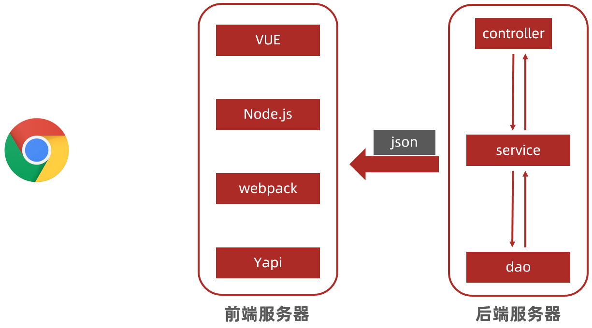

# SpringMVC

#### SpringMVC课程学习方法介绍

SpringMVC是Spring体系结构中的一个技术单元，针对此课程的学习有几点建议推荐给大家

1. SpringMVC技术与前期学习的Servlet技术功能是相同的，都是用来处理请求和产生响应的，因此在学习本门课程的初期应该将精力关注在请求路径怎么设定，请求参数怎么传值，响应如何进行这些方面。
2. 在SpringMVC课程中我们会学习到两种不同的请求发送方式，虽然后期开发以第二种为主，但是第一种形式也要掌握，在第一部分中要讲解比较重要的两组知识就是请求参数与响应相关内容
3. 基于前后端分离技术的大前提下，后期开发不会进行页面的跳转，核心内容将关注返回数据的形式方面，因此从这一部分开始，我们的功能测试都是以PostMan工具为主，无法看到具体的页面信息。因此各位同学学习的时候要注意不仅学习知识，还要关注测试程序时PostMan是如何传递不同种类的数据，比如请求路径参数如何传递，json数据如何传递
4. 除了上述内容，在课程学习完10天以后，将针对SpringMVC进阶相关知识进行学习。所以在SpringMVC基础阶段要把基础操作掌握牢固，这一部分所学知识将直接应用到综合案例的制作中。
5. 最后再啰嗦一句，Java课程学习到框架阶段要切换学习思路，前期学习的基础知识更多的是教你是什么，怎么做，到了框架知识的学习除了是什么，怎么做之外，还要多思考为什么。要多去尝试性的试错，将正确的内容修改错误，观察报错信息，可以帮助你快速积累问题出现后对应的解决方案

#### 课程目录

- SpringMVC简介
- 请求与响应
- REST风格
- SSM整合（注解版）
- 跨域访问

SpringMVC课程整体知识可以简单的划分为2大块，一块是请求数据与响应数据相关内容，另一块是一个全新的知识内容REST风格相关知识。

第一部分请求与响应相关内容与前期学习的Servlet内容相似度很高，主要学习全新的语法格式，可以提前说一点，代码书写上比以前简化了很多。

第二部分REST风格相关知识在学习的时候可能会感觉有些轻微的不适。比如说你不会刷牙，我教你一种刷牙的方式，你用了10年，然后教你第二种，并要求你使用第二种，你怎么看都会觉得不适应，所以这一部分内容要多练习。

前两部分内容学习完毕后，结合Spring课程中学习的整合MyBatis，就可以完成传输中的SSM框架整合了。这个知识非常重要，后面的哦综合案例课程要基于SSM框架结构进行开发的。

话不多说，开始SpringMVC课程的学习。


### 1. SpringMVC简介

前面简单说了一下SpringMVC功能是和Servlet一样的，在具体讲这门技术之前，还是先分析一下Web开发模式的演进过程，这样可以更好的理解SpringMVC在整体技术集中的定位。


#### 1.1 SpringMVC概述

Web程序最初级的开发方式就是Servlet了，浏览器发送一个请求到Web服务器，Web服务器上配置制作好的Servlet，给它一个访问路径就可以调用到对应的Servlet，这是咱们前面学习的内容。

 

其实Servlet还不是最古老的技术，最古老的技术应该是CGI，有兴趣的小伙伴可以了解一下。

https://baike.baidu.com/item/CGI/607810?fr=aladdin

Servlet仅仅能完成接收请求与产生响应，所以真正实现web程序，Servlet仅仅是第一步，内部的话还是会按照三层架构的形式开发，Servlet调用Service，Service调用Dao。Dao把数据给到Service，Service再向上传递给Servlet。


注意这个时候Servlet拿到的仅仅是数据，而给用户看的不能是数据，小白用户哪看的懂这个啊，所以要给他擦胭脂抹粉后给用户看，最终用户看到的是网页。


既然网页是由数据按照一定的格式或者模板展示出来的，于是在这个基础上又派生出了MVC模式。M也就是Model专门描述数据，V也就是View专门描述视图，也可以说是页面。C就独立出来了，Controller，控制用户的请求究竟干什么事情的，这样用户就可以发送不同的请求得到不同的结果了。MVC大火，各个技术大佬在自己不同的语言领域搞出来好多种MVC模式的实现出来。


就这么相安无事的过了若干年，有些程序员又开始躁动了。他们觉得我是高端人才，这HTML这么LOW的东西我写成本太高了，找点初级程序员做吧，慢慢的又出来一批初级程序员在页面这个领域深耕，还真高出了个新玩意——前端。现在前端市场也挺火的，但是人家玩的是展示，我们玩的是数据，两码事。但是前端可不是小打小闹，不光有技术，还有服务器，得嘞，直接从传统开发模式中分离了出来，搞了个前端服务器。


好了，这下彻底分家了，后端开发人员主要关注在数据上，把数据交给前端人员，由前端人员负责展示。这就是前后端分离的由来了。分家是分家了，两边怎么打交道呢？后端说Java对象，前端表示亚历山大。经过无数轮的论战，只能约定一个前后端都通用的数据格式了，json当仁不让扛起了这个工作。



前端拿到数据后，组织成页面给到浏览器，整个请求就完成了。

简单说就是浏览器请求发给前端服务器，前端服务器发请求给后端服务器，后端服务器把数据处理好，以json形式返回，前端拿到json一顿捣鼓后，给用户看最终页面或者数据。

那这和我们的SpringMVC有什么关系呢？仔细看，原来的MVC被拆分后，就剩下了Controller。干完活返回json数据。其实基于前后端分离的开发最终留给我们SpringMVC的工作就只剩下了这两个点了。处理请求，响应json。

这里需要说一点，不是说SpringMVC只能做处理请求，响应json，而是现在的市场主流开发模式是这样的。SpringMVC也可以做页面跳转，也就是不使用前后端分离的技术进行开发。但是此部分内容不作为我们要研究学习的方向，因此在课程中会进行弱化。

来说说SpringMVC到底是什么把

<font color="red">SpringMVC是一种基于Java实现MVC模型的轻量级Web框架</font>

说白了还是一个Web框架，实现了MVC模型，没了。和我们的Servlet功能上没什么大区别。

那为什么学习完Servlet还要学这个呢？它有好处啊

##### 优点

- 使用简单
- 性能突出（相比于Servlet）
- 灵活性强

其实任何技术学习之前看优点都是一脸懵，学完了再体会吧


#### 1.2 入门案例

话不多说，直接上操作，先来个试用装体验一下。

##### 步骤1：导入SpringMVC坐标

```xml
<dependency>
    <groupId>javax.servlet</groupId>
    <artifactId>javax.servlet-api</artifactId>
    <version>3.1.0</version>
    <scope>provided</scope>
</dependency>
<dependency>
    <groupId>org.springframework</groupId>
    <artifactId>spring-webmvc</artifactId>
    <version>5.2.10.RELEASE</version>
</dependenc>
```

SpringMVC的课程版本与Spring保持一致，都是5.2.10。

记得这是做web开发，别忘了servlet的坐标，别忘了scope，不然你就等着启动tomcat的时候duang duang报错吧。

##### 步骤2：初始化SpringMVC环境（同Spring环境）

```java
@Configuration
@ComponentScan("com.itheima.controller")
public class SpringMvcConfig {
}
```

SpringMVC和Spring隶属同源，所以SpringMVC的配置类和Spring的配置类格式一样，别忘了包扫描，回头咱们的控制器都写在com.itheima.controller包中。

##### 步骤3：创建SpringMVC控制器类（等同于Servlet功能）

```java
@Controller
public class UserController {
    @RequestMapping("/save")
    @ResponseBody
    public String save(){
        System.out.println("save...");
        return "{'info':'springmvc'}";
    }
}
```

SpringMVC控制器类的功能和Servlet的功能一样，都是用来接收请求产生响应的。

我们知道接收请求肯定要有一个请求的路径，这里通过@ReqeustMapping这个注解来声明访问的路径，里面给一个字符串参数，就是请求的具体路径了。例如"/save"。当外部请求/save时，就会直接运行注解下面的这个方法。仔细观察一下这个方法比Servlet的方法简单多了，最起码没有参数了，看着就简单

请求得到了产生响应就比较特殊了，正常的SpringMVC可以通过返回值设定跳转的页面的（这个后面再说），但是我们现在前后端分离玩的是返回数据，所以在控制器方法上面再加一个注解@ResponseBody，加上以后这个方法的返回值写什么就返回什么，也就是说可以在返回值上直接写数据了。

##### 步骤4：初始化Servlet容器，并加载SpringMVC环境，并设置SpringMVC请求拦截的路径

```java
public class ServletContainersInitConfig extends AbstractDispatcherServletInitializer {
    protected WebApplicationContext createServletApplicationContext() {
        AnnotationConfigWebApplicationContext ctx = new AnnotationConfigWebApplicationContext();
        ctx.register(SpringMvcConfig.class);
        return ctx;
    }
    protected String[] getServletMappings() {
        return new String[]{"/"};
    }
    protected WebApplicationContext createRootApplicationContext() {
        return null;
    }
}
```

SpringMVC运行肯定离不开web容器，但是SpringMVC对web3.0的注解开发一脸的嫌弃，于是自己搞了快速开发的模式。AbstractDispatcherServletInitializer，这个抽象类就是专门用来初始化web容器的。继承以后强制实现三个方法。

createServletApplicationContext()，这个方法用来加载SpringMVC的核心配置文件的，格式固定，初始化一个控的web应用上下文对象，然后把SpringMVC的配置类注册进去就OK了

getServletMappings()，这个方法是用来说明哪些请求被SpringMVC处理的，当前配置的是"/"，就是所有请求都经过SpringMVC

createRootApplicationContext()，这个方法现在还不需要，简单说一句了解一下，回头业务层的bean归Spring管理，那Spring的配置类不加载到容器中没法用啊，这个方法就是加载Spring的配置类的。

其实上面这个类的书写就是个固定格式，复制粘贴把，到SpringMVC进阶时，我们可以聊聊细节。

##### 步骤5：PostMan测试拦截

【略】


总结：因为SpringMVC是运行在web容器中的，所以必须有一个web容器的配置类。配置类中要设定加载SpringMVC的配置，并设置哪些请求让SpringMVC处理。SpringMVC的配置类与Spring的配置类一样，参照Spring的配置类制作即可。核心工作就在于Controller，里面要标注以下4点，1.要配置成bean，不然没法管理，2.要提供控制器方法，用来处理请求，3.设定访问路径，不然没放访问，4.设置响应结果数据，不然请求完啥也没有得到。


##### 知识点1：@Controller

| 名称 | @Controller                   |
| ---- | ----------------------------- |
| 类型 | 类注解                        |
| 位置 | SpringMVC控制器类定义上方     |
| 作用 | 设定SpringMVC的核心控制器bean |

```java
@Controller
public class UserController {
}
```


##### 知识点2：@RequestMapping  

| 名称 | @RequestMapping                |
| ---- | ------------------------------ |
| 类型 | 方法注解                       |
| 位置 | SpringMVC控制器方法定义上方    |
| 作用 | 设置当前控制器方法请求访问路径 |
| 属性 | value（默认）：请求访问路径    |

```java
@RequestMapping("/save")
public String save(){
    System.out.println("save...");
    return "";
}
```


##### 知识点3：@ResponseBody  

| 名称 | @ResponseBody                                    |
| ---- | ------------------------------------------------ |
| 类型 | 方法注解                                         |
| 位置 | SpringMVC控制器方法定义上方                      |
| 作用 | 设置当前控制器方法响应内容为当前返回值，无需解析 |

```java
@RequestMapping("/save")
@ResponseBody
public String save(){
    System.out.println("save...");
    return "{'info':'springmvc'}";
}
```


##### 知识点4：AbstractDispatcherServletInitializer 类

此类是SpringMVC专用于快速开发web容器初始化配置的工具类，替代web.xml文件。其中createServletApplicationContext方法用于加载SpringMVC核心配置信息，getServletMappings方法用于设定SpringMVC对应的请求映射路径，设置为/表示拦截所有请求，任意请求都将转入到SpringMVC进行处理  

```java
public class ServletContainersInitConfig extends AbstractDispatcherServletInitializer {
    protected WebApplicationContext createServletApplicationContext() {
        AnnotationConfigWebApplicationContext ctx = new AnnotationConfigWebApplicationContext();
        ctx.register(SpringMvcConfig.class);
        return ctx;
    }
    protected String[] getServletMappings() {
        return new String[]{"/"};
    }
    protected WebApplicationContext createRootApplicationContext() {
        return null;
    }
}
```


#### 1.3 入门案例工作流程分析

知其然知其所以然，来一起看看入门案例的整个运行过程。

入门案例的运行分成两个阶段，一个是服务器启动阶段，一个是单次发送请求处理阶段

##### 服务器启动阶段

1. 服务器启动，执行ServletContainersInitConfig类，初始化web容器
2. 执行createServletApplicationContext方法，创建了WebApplicationContext对象
3. 加载SpringMvcConfig
4. 执行@ComponentScan加载对应的bean
5. 加载UserController，每个@RequestMapping的名称对应一个具体的方法
6. 执行getServletMappings方法，定义所有的请求都通过SpringMVC

##### 单次发送请求处理阶段

1. 发送请求localhost/save
2. web容器发现所有请求都经过SpringMVC，将请求交给SpringMVC处理
3. 解析请求路径/save
4. 由/save匹配执行对应的方法save(）
5. 执行save()
6. 检测到有@ResponseBody直接将save()方法的返回值作为请求体返回给请求方


#### 1.4 Controller加载控制与业务bean加载控制

SpringMVC入门案例做完了，有一个地方还空着呢

```java
public class ServletContainersInitConfig extends AbstractDispatcherServletInitializer {
    protected WebApplicationContext createRootApplicationContext() {
        return null;
    }
}
```

前面说过这个东西是用来加载Spring的bean的，这里就把代码加进去

```java
public class ServletContainersInitConfig extends AbstractDispatcherServletInitializer {
    protected WebApplicationContext createRootApplicationContext() {
        AnnotationConfigWebApplicationContext ctx = new AnnotationConfigWebApplicationContext();
        ctx.register(SpringConfig.class);
        return ctx;
    }
}
```

看上去和加载SpringMVC的格式没有任何区别，本来就没区别，比对一下看看

```java
public class ServletContainersInitConfig extends AbstractDispatcherServletInitializer {
    protected WebApplicationContext createServletApplicationContext() {
        AnnotationConfigWebApplicationContext ctx = new AnnotationConfigWebApplicationContext();
        ctx.register(SpringMvcConfig.class);
        return ctx;
    }
    
    protected WebApplicationContext createRootApplicationContext() {
        AnnotationConfigWebApplicationContext ctx = new AnnotationConfigWebApplicationContext();
        ctx.register(SpringConfig.class);
        return ctx;
    }

    protected String[] getServletMappings() {
        return new String[]{"/"};
    }
}
```

还真是没区别，仅仅是加载的配置类发生了变化。

不过这里需要注意一个细节，我们的SpringMVC扫描的是com.itheima.controller包，而Spring扫描的是com.itheima包。简单说，Spring扫描加载的bean包含了SpringMVC控制管理的bean。这肯定不合理啊，功能什么的都不一样。怎么解决呢？两个思路：

1. 精准写扫哪些包
2. 扫的范围大点，把不要的排除掉

对于方式1精准写的方式这里就不介绍了，就是把包名一个一个写，中间用逗号隔开

说说方式2排除的做法，在@ComponentScan注解中可以添加属性来排除掉一些满足规则的被扫描的bean

```java
@Configuration
@ComponentScan(
    value = "com.itheima",
    excludeFilters = @ComponentScan.Filter(
        type = FilterType.ANNOTATION,
        classes = Controller.class
    )
)
public class SpringConfig {
}
```

上述代码中的excludeFilters属性表示排除过滤器，意思是要排除东西了

@ComponentScan.Filter是设定过滤器，里面写具体规则

什么规则呢？满足type是FilterType.ANNOTATION的排除掉，意思就是排除的类型是按照注解排除。也就是说扫描的时候发现了指定注解的bean就排除掉，不加载了

哪个注解呢？classes属性指定了，这里排除的是@Controller注解。注意这里不加@

整体上就可以这样阅读，扫描com.itheima包，排除掉被@Controller注解修饰的bean

这个时候有人就问了，以后写哪一种呢？爱写哪种写哪种，我推荐方式一，不用动脑子，好记，属于一种枚举式的方案。方式二是一种科学的配置方式，不过有个小坑，咱们到进阶再来说这个坑。


------


### 2. 请求与响应

一看名字就知道，下面进入到核心内容了，请求和响应。一个一个来吧，先研究请求。

请求相关内容还不少，我们先研究一下请求的路径，也就是前面写的/save

#### 2.1 请求映射路径

请求的路径前面是加载控制器类的方法上的，写一个表示能够处理一种请求，下面的代码能处理两种请求。

```java
@Controller
public class UserController {
    @RequestMapping("/save")
    @ResponseBody
    public String save(){
        System.out.println("save...");
        return "{'info':'springmvc'}";
    }
    
    @RequestMapping("/update")
	@ResponseBody
	public String update(){
 	   System.out.println("update...");
 	   return "{'info':'springmvc'}";
	}
}
```

这个时候问题就来了，你做User模块写个/save，我做Account模块写个/save，回头加载起来肯定冲突啊。你别说还真是，因此路径这么写肯定不行。改，多加点。把模块名加上，就变成了这样

```java
@Controller
public class UserController {
    @RequestMapping("/user/save")
    @ResponseBody
    public String save(){
        System.out.println("save...");
        return "{'info':'springmvc'}";
    }
    
    @RequestMapping("/user/update")
	@ResponseBody
	public String update(){
 	   System.out.println("update...");
 	   return "{'info':'springmvc'}";
	}
}
```

问题已经解决了，但是你要让老司机看完就会觉得写的有点LOW了，因为这个@RequestMapping还可以写在类上，写完以后统一给这个类的控制器加前缀。下面两个格式效果是等同的

格式一：分开写（推荐）

```java
@Controller
@RequestMapping("/user")
public class UserController {
    @RequestMapping("/save")
    @ResponseBody
    public String save(){
        System.out.println("save...");
        return "{'info':'springmvc'}";
    }
}
```

格式二：合在一起写

```java
@Controller
public class UserController {
    @RequestMapping("/user/save")
    @ResponseBody
    public String save(){
        System.out.println("save...");
        return "{'info':'springmvc'}";
    }
}
```


##### 知识点1：@RequestMapping  

| 名称 | @RequestMapping                                              |
| ---- | ------------------------------------------------------------ |
| 类型 | 方法注解  类注解                                             |
| 位置 | SpringMVC控制器方法定义上方                                  |
| 作用 | 设置当前控制器方法请求访问路径，如果设置在类上统一设置当前控制器方法请求访问路径前缀 |
| 属性 | value（默认）：请求访问路径                                  |

```java
@RequestMapping("/save")
public String save(){
    System.out.println("save...");
    return "";
}
```


#### 2.2 请求参数

下面就是重头戏了，请求中的参数。因为请求中参数有很多种种类，所以内容偏多，但是格式简单。

先看看有多少种参数

- 普通参数
- POJO类型参数
- 数组类型参数
- 嵌套POJO类型参数
- 集合类型参数
  - 普通类型
  - POJO类型

还真不少，一个一个来吧。

##### 普通参数

```JAVA
@RequestMapping("/save")
@ResponseBody
public String save(String name,Integer age){
    System.out.println("参数传递 name ==> "+name);
    System.out.println("参数传递 age ==> "+age);
    System.out.println("--------------");
    return "{'module':'user'}";
}
```

普通参数就是在控制器方法上直接写基本数据类型和字符串类型的参数，怎么才能接收到外面传递的数据呢？只要url地址中的参数名称和这里的变量名相同，类型也能配得上，这样就行了，是不是感觉SpringMVC的优势了？不着急慢慢来，好处后面多的是

有人提出来请求url的参数名如何和这里不一样呢？这个也是可以的，转一下名字就行了

```JAVA
@RequestMapping("/save")
@ResponseBody
public String save(@RequestParam("name")String userName,Integer age){
    System.out.println("参数传递 name ==> "+name);
    System.out.println("参数传递 age ==> "+age);
    return "{'module':'user'}";
}
```

加一个注解<font color="red">**@RequestParam**</font>在形参前面，里面写上url地址上的参数名称。

<font color="red">**@RequestParam**</font>注解大家务必掌握，非常重要！

##### POJO类型参数

```JAVA
@RequestMapping("/saveUser")
@ResponseBody
public String saveUser(User user){
    System.out.println("参数传递 user ==> "+user);
    return "{'module':'user'}";
}
```

POJO类型参数就是在控制器方法上直接写POJO类型的对象参数，这个又怎么接受外面传递的数据呢？只要url地址中的参数名称和POJO中属性名称一一对应就行了。这就行了？对，这就行了。要么说SpringMVC好用呢。之前学习的Servlet要自己搞，取属性，转类型，封装字段，就算你用工具类也要自己写，现在啥都不要写，直接搞定

##### 数组类型参数

```JAVA
@RequestMapping("/saveLikes")
@ResponseBody
public String saveLikes(String[] likes){
    System.out.println("参数传递 likes ==> ");
    Stream.of(likes).forEach(System.out::println);
    return "{'module':'user'}";
}
```

数组类型参数和前面那两个一样，只要你类型写成数组，外面传递多个同名参数就行了，就这么简单。SO EASAY。

##### 嵌套POJO类型参数

```JAVA
@RequestMapping("/saveUserAddress")
@ResponseBody
public String saveUserAddress(User user){
    System.out.println("参数传递 user ==> "+user);
    return "{'module':'user'}";
}
```

万一对象里面又包含对象呢？比如User对象里面有个Address属性，而这个属性又是一个对象，这种怎么处理？一句话，啥都不用管。url传参里面只要是变量名按照层次结构写就行了，比如address.provinceName写上层级就OK了。

看到这里你会发现SpringMVC给我们做的那是相当的到位，什么参数传递？不存在，随便写，只要你有规则，SpringMVC就让你能接到。

##### 集合参数类型

```java
@RequestMapping("/saveList")
@ResponseBody
public String saveList(@RequestParam("likes")List<String> likes){
    System.out.println("参数传递 likes ==> "+likes);
    return "{'module':'user'}";
}
```

集合中保存简单类型其实应用场景还是比较少的，了解一下格式吧。这里需要说明一下，因为保存集合数据肯定传递的参数是多个，这样问题就来了，传进来多个，保存到一个里面，必须把这个事情说清楚。所以这里又用到了@RequestParam这个注解。就这么多把，了解一下。


##### 知识点1： <font color="red">@RequestParam</font>  

| 名称  | <font color="red">@RequestParam</font> |
| ----- | -------------------------------------- |
| 类型  | 形参注解                               |
| 位置  | SpringMVC控制器方法形参定义前面        |
| 作用  | 绑定请求参数与处理器方法形参间的关系   |
| 参数1 | required：是否为必传参数               |
| 参数2 | defaultValue：参数默认值               |

```java
@RequestMapping("/save")
@ResponseBody
public String save(){
    System.out.println("save...");
    return "{'info':'springmvc'}";
}
```


#### 2.3 请求参数（传递json数据）

其实上面的请求参数格式都没有这一组格式用的多，因为以后前后端分离，大部分都是前端向后端传递json数据，所以下面这组操作是重中之重。

后台接收json数据其实并不难，关键是PostMan发送json数据，各位小伙伴还是要好好复习一下。

​	

传递json数据首先请求头要添加Content-Type=application/json这个头信息。但是这个东西不必记他，因为下面的操作会自动添加这个设定的


在请求体body中选择raw，然后数据种类选择JSON。只要选择了JSON，前面的头信息会自动添加前面所述的Content-Type=application/json这个配置，所以这里只需要记得发请求的时候来这里直接输入json数据即可。记得json的数据格式哦，别输入错了。

输入录入问题搞定，下面就说说将json数据传递到后台控制器怎么做

##### 传递json格式对象数据

这种数据传递格式应用面非常广，简单说增删改查中的增和改都要传递对象数据到后台，所以这种格式尤为重要，一起来看一下

##### 步骤1： 设置发送json数据（在请求body中添加数据）  

按照上面的格式添加即可，不再赘述

##### 步骤2：开启接收并处理json数据的支持  

```java
@Configuration
@ComponentScan("com.itheima.controller")
@EnableWebMvc
public class SpringMvcConfig {
}
```

这里所说的开启支持其实就是在SpringMVC的配置类上方加一个注解@EnableWebMvc。不要小看这个注解，它功能及其强大，先卖个关子，后面再详细说它。就记得一点，以后做SpringMVC啥也不说先把它摆上去，没毛病

##### 步骤3：添加json数据转换相关坐标  

```java
<dependency>
    <groupId>com.fasterxml.jackson.core</groupId>
    <artifactId>jackson-databind</artifactId>
    <version>2.9.0</version>
</dependency>
```

前端发json数据到后面了，最后我们要的其实是对象。从json数据转实体类总要有人干活把，必然要使用一些jar包了，这里咱们用jackson来做这个转换的工作。当然你换别的工具类也是可以的。

##### 步骤4：设置接收json数据 

```java
@RequestMapping("/saveJsonUser")
@ResponseBody
public String saveJsonUser(@RequestBody User user){
    System.out.println("参数传递 user ==> "+user);
    return "{'module':'user'}";
}
```

千呼万唤始出来，终于到控制器了。我们知道外面传递的数据是在请求体也就是body里面，而控制器方法接收的数据后要的是一个实体类，比如User。问题来了，SpringMVC怎么知道你是把请求体里面的数据给这个User对象啊，还能咋滴啊，你告诉他啊。所以在形参User对象前面写一个注解， <font color="red">**@RequestBody**</font>。简单粗暴，请求体里面找数据。这个注解应用面很高，敲黑板注意了，重要的事情说三遍。记住，记住，记住。牢记，牢记，牢记

到这里就完事了，其实说白了就2个点

1. 配置类上万年不变的写@EnableWebMvc
2. 外面在请求体里面写数据，里面从请求体里面读数据 <font color="red">**@RequestBody**</font>

至于导入坐标你也算这里一环的话，我也是醉了，以后写坐标先把这大哥搬上来就行了，也是万年不变的写法

##### 传递json格式集合对象数据

看完json对象传递，json数组就更简单了，直接上核心代码，一个字都不带变的，一模一样

```java
@RequestMapping("/saveJsonList")
@ResponseBody
public String saveJsonList(@RequestBody List<User> userList){
    System.out.println("参数传递 userList ==> "+userList);
    return "{'module':'user'}";
}
```

有人说，不对，有变化，后面的参数是List< User >不是User了。废话，我变量还叫userList不叫user呢，看重点，看前面怎么接值的，还是这个注解 <font color="red">**@RequestBody**</font>。完事。

其实有关json数据的传参，主要就是一个 <font color="red">**@RequestBody**</font>，到这里有两个注解是红色加粗标注的，因为它们实用啊，来区分一下。

#####  <font color="red">**@RequestBody**</font>  与  <font color="red">**@RequestParam**</font>区别

区别

- @RequestParam通常用于接收url地址传参，表单传参等【application/x-www-form-urlencoded】
- @RequestBody通常用于接收json数据【application/json】

应用

- 后期开发以前后端分离开发为主，如果前端服务器发送json格式数据，@RequestBody应用较广
- 如果前端服务器发送非application/json格式数据，选用@RequestParam接收请求参数

就这么多了，看一下核心知识点


##### 知识点1：@EnableWebMvc

| 名称 | @EnableWebMvc             |
| ---- | ------------------------- |
| 类型 | SpringMVC配置类注解       |
| 位置 | SpringMVC配置类定义上方   |
| 作用 | 开启SpringMVC多项辅助功能 |

```java
@Configuration
@ComponentScan("com.itheima.controller")
@EnableWebMvc
public class SpringMvcConfig {
}
```


##### 知识点2：<font color="red">@RequestBody</font>  

| 名称 | <font color="red">@RequestBody</font>                        |
| ---- | ------------------------------------------------------------ |
| 类型 | 形参注解                                                     |
| 位置 | SpringMVC控制器方法形参定义前面                              |
| 作用 | 将请求中请求体所包含的数据传递给请求参数，此注解一个处理器方法只能使用一次 |

```java
@RequestMapping("/saveJsonUser")
@ResponseBody
public String saveJsonUser(@RequestBody User user){
    System.out.println("参数传递 user ==> "+user);
    return "{'module':'user'}";                                                           }
```


#### 2.4 日期类型参数传递

我们还忘记了一种比较使用的数据类型，就是日期时间型数据，这个不墨迹，直接上格式，实用也比较简单

```java
@RequestMapping(“/saveData”)
@ResponseBody
public String saveData(@DateTimeFormat(pattern = "yyyy/MM/dd HH:mm:ss")Date date1,
                       @DateTimeFormat(pattern = "yyyy-MM-dd") Date date2,
                       Date date3){
    System.out.println("参数传递 date1 ==> "+date1);
    System.out.println("参数传递 date2 ==> "+date2);
    System.out.println("参数传递 date3 ==> "+date3);
    return "{'module':'user'}";
}
```

上例中给出了三种格式的日期事件数据接收方式，data3是实用默认格式接收，格式是"yyyy/MM/dd"，data2就是使用自定义的格式了，data1是在data2的基础上把时间也加上了。其实说白了就是系统默认了一个格式，你如果想自己定规则，就要用注解@DateTimeFormat设置一下。不用可不可以？可以，必须用框架内定格式。

有人说对象里面如果有这个属性呢？形参位置就加不上了，放在实体类的属性上面写这个格式就OK了。

其实学习到这里大家应该有所感觉，外面输入的字符串2088/08/08最终可以转换成一个Date对象，这个过程不可能是自动的啊，再回忆，json数据直接可以转换成实体类User对象，这个过程也不可能是自动的啊，谁在做呢？一个叫做Converter的东西，这个接口专门负责这个工作，它有好多好多个实现类，只要你需要将A类型转换成B类型，这个接口就会自动匹配，然后找一个合适的实现类去承担这个工作。所以后面再见到类型自己转换了，百分之百是它在干活。


##### 知识点1：@DateTimeFormat  

| 名称 | @DateTimeFormat                                              |
| ---- | ------------------------------------------------------------ |
| 类型 | 形参注解  实体类属性注解                                     |
| 位置 | SpringMVC控制器方法形参定义前面  实体类日期型数据属性定义上方 |
| 作用 | 设定日期型数据格式                                           |
| 属性 | pattern：日期时间格式字符串                                  |

```java
@Configuration@ComponentScan("com.itheima.controller")
@EnableWebMvc
public class SpringMvcConfig {
}
```


#### 2.5 响应

请求说完了，来说说响应。按照Servlet的学习经验，响应其实就是生成用户看的数据，其实就是带有数据的页面了。JSP技术的加入将这个过程又进行了拆分，页面是页面，数据是数据，然后在页面上加载数据，像前面学习的request.setAttribute()和session.setAttribute()这些操作应该都不陌生，就是干这些事情的。但是现在又变了，前后端分离了，页面没了，都跑到前端服务器了，就只剩数据了。所以我们只需要关注如何传递数据就行了。

不过这里需要明确一点，SpringMVC还是能够跳转页面的，咱们不做深度的研究，但是跳转页面毕竟是一种形式，了解一下。

下面针对SpringMVC的三种常见的响应方式进行学习，前面两种了解，重点学习最后一种，响应json数据。

- 跳转页面（了解）
- 响应文本数据（了解）
- 响应json数据（重点）

##### 跳转页面

跳转页面非常简单，控制器方法的返回值设置成String，最后return的东西写页面名称就行了，例如：

```java
@RequestMapping("/toPage")
public String toPage(){
    return "/page.jsp";
}
```

记得不要加@ResponseBody，前面写习惯了，别顺手加上了，这样就无法跳转页面了。记得页面必须存在，不然就等着404把。

当然跳转页面是可以在页面上加载数据的，那数据怎么传递？页面怎么显示？咱们这里就不做研究了。这种形式了解即可。

##### 响应文本数据

响应文本数据其实各位同学一直在用，前面的每一个例子都是响应文本数据。

```java
@RequestMapping("/toText")
@ResponseBody
public String toText(){
    return "response text";
}
```

有人会说，这不是响应json数据吗？怎么是响应文本数据？其实前面是自己写了个文本数据，只不过文本数据的格式是json格式。返回值类型设置成String，最终return的字符串就是文本数据。至于文本里面写什么，那就是你的自由了。

##### 响应json数据

来说说我们重点掌握的响应json数据吧，格式其实已经学习过了，看下面的代码

```JAVA
@RequestMapping("/toJsonPOJO")
@ResponseBody
public User toJsonPOJO(){
    User user = new User();
    user.setName("赵云");
    user.setAge(41);
    return user;
}
```

这就是响应json数据了，要返回的数据设置为返回值，添加@ResponseBody注解就可以了。和前面响应文本有什么不同呢？返回值类型设置的是对象，return的结果也是对象。有人说这就行了？对，这就可以了。这里有几个问题要思考一下：

1. User对象转换成json数据是谁做的？
2. 谁控制将返回值User对象转换成json数据的？

一个一个来说，User对象要想转换成json数据，这种操作我们早就学习过，前面咱们导入了一个坐标，jackson的坐标，他就能来干这件事。第一个问题解决了。


除了POJO的对象之外，前端还会传递过来多个对象，也就是POJO的集合，这种也可以转换。

##### 响应json数组数据

```JAVA
@RequestMapping("/toJsonList")
@ResponseBody
public List<User> toJsonList(){
    User user1 = new User();
    user1.setName("赵云");
    user1.setAge(41);
    User user2 = new User();
    user2.setName("master 赵云");
    user2.setAge(40);
    List<User> userList = new ArrayList<User>();
    userList.add(user1);
    userList.add(user2);
    return userList;
}
```

方式方法都是一样的，要响应什么数据，直接将数据设置成返回值，自动转换就OK了。

这里有一个知识点要修复一下了，关于@ResponseBody，之前说它的作用是设置当前控制器方法响应内容为当前返回值，无需解析，这里要修复成设置当前控制器返回值作为响应体。

此外，如果每一个控制器的方法都要加@ResponseBody的话非常繁琐，也可以把这个注解加载类上方，这样就可以简化配置工作量


##### 知识点1：<font color="red">@ResponseBody</font>  

| 名称 | <font color="red">@ResponseBody</font>                       |
| ---- | ------------------------------------------------------------ |
| 类型 | 方法注解  类注解                                             |
| 位置 | SpringMVC控制器方法上方   SpringMVC控制器类上方              |
| 作用 | 设置当前控制器返回值作为响应体  设置当前类所有控制器方法返回值作为响应体 |

```java
@RequestMapping("/saveJsonUser")
@ResponseBody
public String saveJsonUser(@RequestBody User user){
    System.out.println("参数传递 user ==> "+user);
    return "{'module':'user'}";                                                           }
```


------


### 3.REST风格

REST风格这一部分的学习对前期学习的内容颠覆性还是比较强的，同时也是后期大量使用的知识，各位同学务必认真学习。这一部分知识理解难度高，操作难度低。

#### 3.1 REST风格简介

REST（Representational State Transfer），表现形式状态转换

从整体上来说，这个词比较难理解，拆开来看，Representational解释为表现形式。什么是表现形式呢？比如你硬盘上有一个图片文件。你打开这张图片，能看到图片信息，可能是这样的


假如你换一种打开方式，比如使用记事本打开，可能会是这样的


这是啥呀？从内心来说，我们是拒绝的，好好的一张图，这是啥嘛。这里要告诉大家的是虽然是同一个文件，因为操作方式不同，最终看到两种不同的结果，这个就是表现形式。对于图片来说是这样，对于任意的事物来说，一个东西它的表现形式可以是不同的，通过不同的形式打开，显示效果就不一样。这就是我们所说的表现形式状态切换。

这里面有两个核心概念。第一，资源描述是唯一的，就像上面的图片在计算机上保存是唯一确认的数据。第二，不同的操作方式导致最终资源呈现结果不同。

我们将上面的概念扩展到Web开发的过程中，比如描述网站中的一个资源，它的格式是这样的

```html
http://localhost/users
```

这个格式代表什么呢？代表一个网络上的用户信息，就像是前面例子的中的图片文件。那有没有不同的打开方式呢？还真有，比如通过GET提交或者POST提交，就是两种不同的打开方式。

换句话说，上面这个URL地址通过GET提交可能是一种结果，通过POST提交可能是另一个结果。

这个时候有人就提出了，我感觉这样有问题，我之前是这么写的

```html
http://localhost/users/save		#新增
http://localhost/users/delete	#删除
http://localhost/users/update	#修改
http://localhost/users/getById	#查询
```

这么写挺好啊，不仅可以非常清晰的确认这是操作什么东西，还知道是何种操作。没错，但是从URL地址中直接暴露了你的操作行为这个是显而易见的，比如save,delete这种操作。并且从书写格式上来说，虽然都是对同一个资源进行操作访问，但是格式有这么多种，不觉得有点多，有点复杂吗？REST风格就说了，你上面这些操作都可以合并成一种格式，事实上，下面这个访问格式就是REST风格访问网络资源的标准格式

```html
http://localhost/users
```

##### REST风格标准动作（行为）

既然上面这一个URL就可以描述一个资源了，那怎么区分增删改查呢？就是使用上面说的请求方式来进行区别。在PostMan中，是否留意过下面这个画面？


提交方式够丰富吧，REST风格网络资源访问路径配合这些请求方式就可以组成出多种资源打开方式。其中GET表示查询，POST表示新增，PUT表示修改，DELETE表示删除，还有其他的就先预留下来。实际上上面这种资源的请求方式有一个专业的名称，叫做RESTful。

RESTful是一种网络应用程序的设计风格和开发方式。下面列出的就是标准Restful开发的资源访问格式

- http://localhost/users		查询全部用户信息	
- http://localhost/users/1		查询指定用户信息
- http://localhost/usesr		添加用户信息
- http://localhost/usesr		修改用户信息
- http://localhost/users/1		删除用户信息 

切记切记，下面这个对应关系。

| 请求方式 | 对应操作 |
| -------- | -------- |
| GET      | 查询     |
| POST     | 新增     |
| PUT      | 修改     |
| DELETE   | 删除     |

有人说，我发GET请求就做新增，能不能行？能行，没问题。我们假设一个场景，全世界99.99%的开发者都认为GET对应查询，你非做新增，你觉得合适么？明显的格格不入啊，团队里有你这么一路人，活就别干了。

上面的这组对应关系是开发者共同制定出来的，所以尽量遵从，但是可以打破。因此REST不叫REST规范，叫REST风格。老师这里说一句，劝你善良，且行且珍惜。

说了这么多都是理论知识，下面就切换战场看看Restful具体怎么开发


#### 3.2 入门案例

其实按照Restful形式进行开发和普通形式差别不大，主要就是要区分出请求方式。看看下面的操作就一目了然了，就多了一个属性配置。

```JAVA
@Controller
public class BookController {  
    @RequestMapping(value = "/books",method = RequestMethod.POST)
    @ResponseBody
    public String save(){
        System.out.println("book save...");
        return "{'module':'book'}";
    }

    @RequestMapping(value = "/books",method = RequestMethod.DELETE)
    @ResponseBody
    public String delete(){
        System.out.println("book delete...");
        return "{'module':'book'}";
    }
}
```

如果说你没看出来哪里有变化也不奇怪，因为变化是在太小了。还记得刚才说过用请求方式区分吗？仔细看@RequestMapping注解中多了一个属性method。当你需要发送POST请求，也就是做新增时，在注解中添加method属性，并设置对应的值RequestMethod.POST。

上面这两个操作都是新增和删除，没有牵扯到传递参数。RESTful开发如果传递参数，有一种全新的方式，也是目前最流行的RESTful开发传参方式，叫做路径参数。比如查询id为1的图书数据请求访问格式是这么写的

```html
http://localhost/books/1
```

注意，请求路径里面的1可不是以前的参数1，而是请求路径的一部分。Servlet中传递的参数是写在问号后面的，并且有变量名，比较一下

```html
http://localhost/users/getById?id=1
```

这种路径里面的参数叫做路径参数。既然是路径参数，那么后台接收路径的方式就发生改变了，看看查询操作的书写格式

```java
@Controller
	public class BookController {
	@RequestMapping(value = "/books/{id}",method = RequestMethod.GET)
	@ResponseBody
	public String get(@PathVariable String id){
		System.out.println("book get..." + id);
		return "{'module':'book'}";
    }
}
```

注意观察，@RequestMapping的value属性书写的是/books/{id}。其中包含{id}，这个东西出现在路径里。这个在路径中的参数怎么得到呢？两步搞定

1. 在控制器方法的形参上面写一个变量，变量名与路径中的名称相同
2. 在参数前面添加注解@PathVariable

注意形参名称与路径参数名称保持一对一就可以了，多个参数就写多个形参。

到这里咱们就学习了三种获取请求数据的方式，比对一下

##### @RequestBody  @RequestParam  @PathVariable 比对

- 区别
  1. @RequestParam通常用于接收url地址传参
  2. @RequestBody通常用于接收json数据
  3. @PathVariable通常用于接收路径参数，使用{参数名称}描述路径参数
- 应用
  1. 后期开发以前后端分离开发为主，如果前端服务器发送json格式数据，@RequestBody应用较广
  2. 如果前端服务器发送非application/json格式数据，选用@RequestParam接收请求参数
  3. 采用RESTful进行开发，请求功能采用路径参数描述


##### 知识点1：@RequestMapping  

| 名称  | @RequestMapping                               |
| ----- | --------------------------------------------- |
| 类型  | 方法注解                                      |
| 位置  | SpringMVC控制器方法定义上方                   |
| 作用  | 设置当前控制器方法请求访问路径                |
| 属性1 | value（默认）：请求访问路径                   |
| 属性2 | http请求动作，标准动作（GET/POST/PUT/DELETE） |

```java
@RequestMapping(value = "/books",method = RequestMethod.POST)
@ResponseBody
public String save(){
    System.out.println("book save...");
    return "{'module':'book'}";
}
```


##### 知识点2：<font color="red">@PathVariable</font>  

| 名称 | <font color="red">@PathVariable</font>                       |
| ---- | ------------------------------------------------------------ |
| 类型 | 形参注解                                                     |
| 位置 | SpringMVC控制器方法形参定义前面                              |
| 作用 | 绑定路径参数与处理器方法形参间的关系，要求路径参数名与形参名一一对应 |

```java
@RequestMapping(value = "/books/{id}",method = RequestMethod.GET)
@ResponseBody
public String get(@PathVariable String id){
    System.out.println("book get..." + id);
    return "{'module':'book'}";
}
```


#### 3.3 RESTful快速开发（标准增删改查）

入门案例告一段落，下面就来一套标准增删改查的制作，这一套制作以后要用很久，  <font color="red">**要用心写，要写熟练**</font>

SpringMVC针对RESTful的开发做了若干优化，咱们先把这些优化说完，再上最终版的代码

##### 优化1：合并重复书写的注解

因为每个处理器方法上方都要写@ResponseBody，可以将这个注解写在类上方，这样处理器方法上方就不用写了。而每个处理器类上面都要有@Controller和@ResponseBody，SpringMVC就把这两个注解整合到了一起，形成一个新的注解，叫做@RestController。挺好，一看就知道REST风格的控制器

##### 优化2：简化@RequestMapping书写

每次写请求映射地址，不仅要写路径，还要写请求方法，SpringMVC就做了若干个衍生注解。啥意思呢？比较下面两个书写方式，是同样的功能

改造前：

```JAVA
@RequestMapping(value = "/books/{id}",method = RequestMethod.GET)
```

改造后：

```JAVA
@GetMapping("/books/{id}")
```

其他的都一样，GET请求@Get开头，POST请求@Post开头。

##### 优化3：简化路径的配置书写

这个其实不是针对RESTful优化的，是前面就有，比如"/books/{id}"，可以拆分成类上面写/books，在控制器方法上面只写一个/{id}，也能多少减少一些书写量。


综合上面的各种优化，下面直接上最终成品

```java
@RestController
@RequestMapping("/books")
public class BookController {
    //查询全部
    @GetMapping
    public String get(){
        System.out.println("book getAll...");
        return "{'module':'book'}";
    }
    //查询单个
    @GetMapping("{id}")
    public String get(@PathVariable String id){
        System.out.println("book get..." + id);
        return "{'module':'book'}";
    }
    @PostMapping
    public String save(@RequestBody User user){
        System.out.println("book save user: " + user);
        return "{'module':'book'}";
    }
    @PutMapping
    public String update(@RequestBody User user){
        System.out.println("book update user: " + user);
        return "{'module':'book'}";
    }
    @DeleteMapping("{id}")
    public String delete(@PathVariable String id){
        System.out.println("book delete..." + id);
        return "{'module':'book'}";
    }
}
```

上面的内容还是有几个点要说明一下：

1. 所有的请求路径都需要添加/books这个路径，所以抽取出来，写在类的上面，这个用的是@RequestMapping注解。路径为什么写books而不是book，行业规范，没商量

2. 查询全部因为不需要添加其他参数，所以请求路径就是/books，因此下面的@GetMapping没有请求路径

3. 查询单个和删除操作需要传递id，这个id标准开发使用的是路径参数，当然也可以换其他的，比如请求体参数

4. 添加和修改操作传递的参数较多，建议使用请求体参数

   

##### 知识点1：@RestController

| 名称 | @RestController                                              |
| ---- | ------------------------------------------------------------ |
| 类型 | 类注解                                                       |
| 位置 | 基于SpringMVC的RESTful开发控制器类定义上方                   |
| 作用 | 设置当前控制器类为RESTful风格，等同于@Controller与@ResponseBody两个注解组合功能 |

```java
@RestController
public class BookController {
}
```


##### 知识点2：@GetMapping  @PostMapping  @PutMapping  @DeleteMapping  

| 名称 | @GetMapping  @PostMapping  @PutMapping  @DeleteMapping       |
| ---- | ------------------------------------------------------------ |
| 类型 | 方法注解                                                     |
| 位置 | 基于SpringMVC的RESTful开发控制器方法定义上方                 |
| 作用 | 设置当前控制器方法请求访问路径与请求动作，每种对应一个请求动作 |
| 属性 | value（默认）：请求访问路径                                  |

```java
@GetMapping
public String get(){
    System.out.println("book getAll...");
    return "{'module':'book'}";
}
```


#### 3.4 数据过滤

上面的制作中仔细看发现少一个操作，分页查询。其实不是少一个操作，而是操作的时候通常我们会根据情况做一些数据的筛选过滤。比如获取一部分，也就是分页了。比如获取的数据希望有个排序结果，甚至按条件查询。这些都是为了过滤数据的，这一系列的操作统统归属数据的查询结果过滤。

常见的过滤条件如下，不是全部，只是常用的列出来

| 功能               | 属性（示例）          |
| ------------------ | --------------------- |
| 每页显示数         | limit=10              |
| 数据开始位置       | offset=10             |
| 第几页，每页显示数 | page=2&perPage=10     |
| 排序字段，排序规则 | sortby=name&order=asc |
| 查询条件           | bookType=1            |

上个示例看看，对于参数的传递三种都可以使用，请求参数，请求体参数，路径参数均可。主流的方式是请求体传参，也就是@ResponseBody了，下面看2种不常写的格式，算作复习把。先看请求参数的

```JAVA
@GetMapping("/books")
public String get(Integer page,Integer prePage){
    System.out.println("book getAll...page :" + page + " , prePage :" + prePage);
    return "{'module':'book'}";
}
```

再看看路径参数的

```java
@GetMapping("/books/{page}/{prePage}")
public String get(@PathVariable Integer page,@PathVariable Integer prePage){
    System.out.println("book getAll...page :" + page + " , prePage :" + prePage);
    return "{'module':'book'}";
}
```

访问路径也需要调整一下，下面的格式就是访问第2页，每页显示10条

```java
http://localhost/books/2/10
```

到这里RESTful的基础开发就先学习到这里，还有对应的高级操作，到框架进阶中学习


------


### 4.SSM整合

到这里有关SpringMVC的基础开发就告一段落了，下面进入核心的SSM三大框架整合，Spring、SpringMVC、MyBatis三个框架整合使用。

#### 4.1 Spring整合MyBatis（复习）

前期学习了Spring整合MyBatis，简单复习一下，再将分页查询加上。直接上整合后的结果。

1.Spring核心配置

```JAVA
@Configuration
@ComponentScan("com.itheima")
@PropertySource("classpath:jdbc.properties")
@Import({JDBCConfig.class, MyBatisConfig.class})
public class SpringConfig {
}
```

开启了bean的扫描，加载了jdbc.properties文件，这个配置加载后为JDBCConfig类使用，同时又加载了MyBatis的配置类

2.JDBC配置类

```java
public class JDBCConfig {
    @Value("${jdbc.driver}")
    private String driver;
    @Value("${jdbc.url}")
    private String url;
    @Value("${jdbc.username}")
    private String userName;
    @Value("${jdbc.password}")
    private String password;
    
    @Bean(value="dataSource")
    public DataSource getDataSource(){
        DruidDataSource ds = new DruidDataSource();
        ds.setDriverClassName(driver);
        ds.setUrl(url);
        ds.setUsername(userName);
        ds.setPassword(password);
        return ds;
    }
}
```

声明了DruidDataSource的对象，使用@Value注入了Druid连接数据库需要的数据，数据来自于jdbc.properties文件

3.数据库连接配置信息

```JAVA
jdbc.driver=com.mysql.jdbc.Driver
jdbc.url=jdbc:mysql://localhost:3306/springmvc_db
jdbc.username=root
jdbc.password=itheima
```

4.Spring整合MyBatis配置类

```JAVA
public class MyBatisConfig {
    @Bean
    public SqlSessionFactoryBean getSqlSessionFactoryBean(DataSource dataSource){
        SqlSessionFactoryBean ssfb = new SqlSessionFactoryBean();
        ssfb.setTypeAliasesPackage("com.itheima.domain");
        ssfb.setDataSource(dataSource);
        return ssfb;
    }
    @Bean
    public MapperScannerConfigurer getMapperScannerConfigurer(){
        MapperScannerConfigurer msc = new MapperScannerConfigurer();
        msc.setBasePackage("com.itheima.dao");
        return msc;
    }
}
```

5.实体类

```JAVA
public class Account implements Serializable {
    private Integer id;
    private String name;
    private Double money;
}
```

6.Dao接口+映射配置

```JAVA
public interface AccountDao {
    @Insert("insert into account(name,money)values(#{name},#{money})")
    void save(Account account);
    @Delete("delete from account where id = #{id} ")
    void delete(Integer id);
    @Update("update account set name = #{name} , money = #{money} where id = #{id} ")
    void update(Account account);
    @Select("select * from account")
    List<Account> findAll();
    @Select("select * from account where id = #{id} ")
    Account findById(Integer id);
}
```

7.业务层接口

```JAVA
public interface AccountService {
    void save(Account account);
    void delete(Integer id);
    void update(Account account);
    List<Account> findAll();
    Account findById(Integer id);
}
```

业务层接口中目前没有分页相关功能

8.业务层实现类

```JAVA
@Service
public class AccountServiceImpl implements AccountService {
    @Autowired
    private AccountDao accountDao;
    
    public void save(Account account) {
        accountDao.save(account);
    }
    
    public void update(Account account){
        accountDao.update(account);
    }
    
    public void delete(Integer id) {
        accountDao.delete(id);
    }
    
    public Account findById(Integer id) {
        return accountDao.findById(id);
    }
    
    public List<Account> findAll() {
        return accountDao.findAll();
    }
    
}
```

使用@Service将业务层实现类声明为bean

9.JUnit单元测试类，测试业务层接口功能

```JAVA
@RunWith(SpringJUnit4ClassRunner.class)
@ContextConfiguration(classes = {SpringConfig.class})
public class AccountServiceTest {
    @Autowired
    private AccountService accountService;
    
    @Test
    public void testSave(){
        Account account = new Account();
        account.setName("Jock");
        account.setMoney(1d);
        accountService.save(account);
    }
    
    @Test
    public void testDelete(){
        Account account = new Account();
        accountService.delete(3);
    }

}
```

以上是部分业务层接口功能的测试


##### 分页功能制作

由于当前功能中没有分页功能，先将分页功能添加上去

##### 步骤1： 导入坐标

```JAVA
<!--分页插件坐标-->
<dependency>
    <groupId>com.github.pagehelper</groupId>
    <artifactId>pagehelper</artifactId>
    <version>5.1.2</version>
</dependency>
```

先导入pagehelper的坐标

##### 步骤2：配置分页插件bean 

```java
public class MyBatisConfig {
    @Bean
    public SqlSessionFactoryBean getSqlSessionFactoryBean(DataSource dataSource,Interceptor interceptor){
        SqlSessionFactoryBean ssfb = new SqlSessionFactoryBean();
        ssfb.setTypeAliasesPackage("com.itheima.domain");
        ssfb.setDataSource(dataSource);
        ssfb.setPlugins(new Interceptor[]{interceptor});
        return ssfb;
    }
    
    @Bean
    public Interceptor getPageInterceptor(){
        Interceptor interceptor = new PageInterceptor();
        Properties properties = new Properties();
        properties.setProperty("helperDialect","mysql");
        properties.setProperty("reasonable","true");
        interceptor.setProperties(properties);
        return interceptor;
    }
}
```

MyBatis加入分页功能是通过插件的形式实现的，因此需要先将分页插件声明为Spring的bean，然后在MyBatis中设置对应的插件即可。注意，插件设置一次是设置多个，因此SqlSessionFactoryBean设置插件的方法是setPlugins，而非setPlugin。后面传递的参数也是一个数组。

上述格式为固定格式，同学们可以更新一下Spring整合MyBatis的标准代码了。

##### 步骤3：添加分页功能（接口与实现类）

```java
public interface AccountService {
    List<Account> findAll();
    
    //分页查询
    PageInfo<Account> findAll(int page, int size);
}
```

```java
@Service
public class AccountServiceImpl implements AccountService {
    public PageInfo<Account> findAll(int page, int size) {
        PageHelper.startPage(page,size);
        List<Account> all = accountDao.findAll();
        return new PageInfo<Account>(all);
    }
}
```

在业务层接口上添加分页接口，注意返回值是PageInfo，泛型填写当前模块pojo。业务层实现类上对分页接口进行实现，注意设置分页数据要写在查询的前面。

到这里就把分页功能加上了，和之前书写相比，就是将原来MyBatis配置中的拦截器换了个形式，分页拦截器转换成了bean，然后添加到MyBatis的核心对象中即可。

之前学习Spring的时候，整合MyBatis时还没有讲解事务，这次一并将事务加上。

##### 事务处理（复习）

事务相关操作之前已经学习过并使用过了，在讲转账案例的时候用过这个东西。快速复习一下。

##### 步骤1：定义事务管理器

```JAVA
public class JDBCConfig {
    @Bean
    public PlatformTransactionManager getTransactionManager(DataSource dataSource){
        return new DataSourceTransactionManager(dataSource);
    }
}
```

添加事务首先需要一个事务管理器的对象，MyBatis用的是JDBC的事务，因此事务管理器用JDBC的事务管理器即可。记得事务管理器要注入DataSource，而且要和MyBatis用相同的DataSource，否则就无法进行管理了。

##### 步骤2：开启注解式事务管理 

```java
@Configuration
@ComponentScan("com.itheima")
@PropertySource("classpath:jdbc.properties")
@Import({JDBCConfig.class, MyBatisConfig.class})
@EnableTransactionManagement
public class SpringConfig {
}
```

没什么好说的，就是一个注解@EnableTransactionManagement搞定，否则后面添加事务就无法被正常识别，也就无法工作了。

##### 步骤3：业务层接口上开启事务

```java
@Transactional
public interface AccountService {
}
```

事务开启在业务层接口上，避免更换实现类后，事务功能消失。

在Spring整合MyBatis的复习这一部分，新东西只有一个，就是分页功能的制作，格式也比较固定。


#### 4.2 Spring整合SpringMVC

重头戏来了，完成这一部分，SSM就完成了基础的整合工作。

Spring整合SpringMVC都有哪些工作要做呢？最基本的web环境要配置把，同时启动的时候要加载SpringMVC对应的配置。并且我们Spring的环境回头也要运行在Web容器中，所以也要加进去。大环境配置完，剩下就是用什么开发什么了，多一个模块，就多一个Controller就OK了。至于开发风格，肯定是RESTful了。一步一步来吧。

##### 步骤1：web3.0环境配置

```JAVA
public class ServletContainersInitConfig extends AbstractDispatcherServletInitializer {
    protected WebApplicationContext createServletApplicationContext() {
        AnnotationConfigWebApplicationContext ctx = new AnnotationConfigWebApplicationContext();
        ctx.register(SpringMvcConfig.class);
        return ctx;
    }
    
    protected String[] getServletMappings() {
        return new String[]{“/”};
    }
    
    protected WebApplicationContext createRootApplicationContext() {
        AnnotationConfigWebApplicationContext ctx = new AnnotationConfigWebApplicationContext();
        ctx.register(SpringConfig.class);
        return ctx;
    }
}
```

这一部分没什么好解释的，固定格式，也不是第一次写了，就三句话。SpringMVC配置要加载，Spring配置要加载，将请求映射传递给SpringMVC处理。

##### 步骤2：SpringMVC配置

```java
@Configuration
@ComponentScan("com.itheima.controller")
@EnableWebMvc
public class SpringMvcConfig {
}
```

上面都已经加载SpringMVC的配置类了，肯定要做出来，两个细节复习一下。

1. 扫描的时候只加载controller包里的bean，扫描路径检查一下
2. 开启@EnableWebMvc注解，这个功能很强大，到进阶咱们慢慢解析它的功能。现在就记得这是标准开发的一部分。

##### 步骤3：修正Spring配置类的扫描路径

```java
@Configuration
@ComponentScan("com.itheima.service")
@PropertySource("classpath:jdbc.properties")
@Import({JDBCConfig.class, MyBatisConfig.class})
@EnableTransactionManagement
public class SpringConfig {
}
```

以前我们spring扫描的时候都是扫com.itheima包，现在这里面明显包含着controller呢，有人说用排除，排除掉，太费事了，缩小范围，只扫service。有人又说玩意没扫到该扫的东西呢？再加呗。

如果是单独的要加载的东西，使用@Import加载，如果是多个，再配置上一个包就行了。

##### 步骤4：基于Restful的Controller开发

```java
@RestController
@RequestMapping("/accounts")
public class AccountController {
    
    @Autowired
    private AccountService accountService;
    
    //添加
    @PostMapping
    public boolean save(@RequestBody Account account){
        accountService.save(account);
        return true;
    }
    
    //删除
    @DeleteMapping("/{id}")
    public boolean delete(@PathVariable Integer id){
        accountService.delete(id);
        return true;
    }
    
    //修改
    @PutMapping
    public boolean update(@RequestBody Account account){
        accountService.update(account);
        return true;
    }
    
    //查询单个
    @GetMapping("/{id}")
    public Account get(@PathVariable Integer id){
        return accountService.findById(id);
    }
    
    //查询全部
    @GetMapping
    public List<Account> getAll(){
        return accountService.findAll();
    }
    
    //分页查询
    @GetMapping("/{page}/{size}")
    public PageInfo<Account> getPage(@PathVariable int page, @PathVariable int size){
        return accountService.findAll(page,size);
    }

}
```

回顾一下几个点：

1. bean的定义使用@RestController，这一个注解顶两个用，@Controller加上@ResponseBody
2. 公共的请求路径前缀加上，用于区分模块的，记得后面加s
3. 使用@RequestMapping的衍生格式来写请求映射地址，一共4个
4. 分页这个操作其实标准开发用的是请求体参数，因为里面要封装的东西很多，排序啊，查询条件啊。但是咱们这里没有做这样的功能，就多复习一下路径参数。

到这里Spring整合SpringMVC就结束了，SSM整合的基础工作到此结束。


#### 4.3 表现层数据封装

目前我们整合完SSM后，各种操作返回的数据是什么样子咱们分析一下。

新增、修改、删除操作返回字符串true

```java
true
```

查询单个操作返回json对象

```JAVA
{
    "id": 1,
    "name": "Tom",
    "money": 1000.0
}
```

查询全部操作返回json数组

```JAVA
[
    {
        "id": 1,
        "name": "Tom",
        "money": 1000.0
    },
    {
        "id": 2,
        "name": "Jerry",
        "money": 1100.0
    }
]
```

分页查询操作返回分页json数据

```JAVA
{
    "pageNum": 1,
    "pageSize": 2,
    "size": 2,
    "startRow": 1,
    "endRow": 2,
    "total": 5,
    "pages": 3,
    "list": [
        {
            "id": 1,
            "name": "Tom",
            "money": 1000.0
        },
        {
            "id": 2,
            "name": "Jerry",
            "money": 1100.0
        }
    ],
    "prePage": 0,
    "nextPage": 2,
    "isFirstPage": true,
    "isLastPage": false,
    "navigatePages": 8,
    "navigateFirstPage": 1,
    "navigateLastPage": 3,
    "lastPage": 3,
    "firstPage": 1
}
```

上述几种基本操作返回的结果五花八门，有非json数据，有json对象，有json数组。这样的数据如果传递到前端服务器上，前端人员看完会崩溃的。格式太多啦，这活儿没法搞了。于是前端人员提出了要求。

##### 统一数据格式

经过沟通，达成一致，数据都放在data属性中，不管返回什么数据，都放data中，必须安排。

新增、修改、删除操作返回数据格式

```java
{
    "data": true
}
```

查询单个操作返回json对象

```JAVA
{
    "data": {
        "id": 1,
        "name": "Tom",
        "money": 1000.0
    }
}
```

##### 业务操作状态码

改完了，前端人员操作了几下，又发现问题了。增删改操作完结果都一样，这区分不出来啊。

也对，怎么才能区分出来呢？看来只能再加一个数据了，用一个数字表示这是新增、修改、还是删除。做web开发的时候页面出问题还给返回个404,500什么的，我们也搞一组数字，不同的数字代表不同的操作。继续安排

新增操作返回数据格式

```java
{
    "code": 20011,
    "data": true
}
```

删除操作返回数据格式

```java
{
    "code": 20021,
    "data": true
}
```

修改操作返回数据格式

```java
{
    "code": 20031,
    "data": true
}
```

查询单个操作返回数据格式

```JAVA
{
    "code": 20041,
    "data": {
        "id": 1,
        "name": "Tom",
        "money": 1000.0
    }
}
```

加一组数字，20011表示添加，20021表示删除，20031表示修改，20041表示查询单个，等等。这下可以分出来了。

##### 业务操作状态码成功失败区分

改完前端人员又点了记下，又双叒叕发现问题了。查询了一个id存在的数据返回结果如下

```JAVA
{
    "code": 20041,
    "data": {
        "id": 1,
        "name": "Tom",
        "money": 1000.0
    }
}
```

查询一个id不存在的数据返回结果如下

```JAVA
{
    "code": 20041,
    "data": null
}
```

前端人员就比较崩溃了，问你，20041我是取数据还是不取数据啊？

也对，20041只能表示查询单个操作，但是成功还是失败区分不出来。怎么办？还能怎么办？分开呗，1结尾的表示成功20041,20031，都是成功。0结尾的表示失败，20040,20030都是失败，搞定。

现在就可以有效区分操作种类和操作结果了。

查询单个成功

```JAVA
{
    "code": 20041,
    "data": {
        "id": 1,
        "name": "Tom",
        "money": 1000.0
    }
}
```

查询单个失败

```JAVA
{
    "code": 20040,
    "data": null
}
```

##### 追加业务消息

前端人员说，你这20040代表的是查询数据失败了。那，我怎么给用户说呢？我是告诉他再试一次？还是告诉他服务器有问题，请稍后再试？或者现在系统正在维护，让他明天再试？你就给我说个20040，我哪里知道什么情况啊？

事还真多，但是你别说，前端这小子想的还挺周全。看来必须再加个东西了，如果发现业务失败了，再给前端提供个消息，让前端把这个消费给用户展示，搞定。

```JAVA
{
    "code": 20040,
    "data": null,
    "message": "数据查询失败，请重试！"
}
```

前端人员看完，嗯，行吧，先这样吧，有新需求再说。

其实问题解决到这里，我们发现，我们缺少一种有效的和前端人员进行数据交换的标准形式，这个形式是在团队内部规定好的，不同团队，不同项目会根据需要制定不一样的约定，这个约定其实就是前后端开发联调的协议。在综合案例课程中我们再用专用的工具解决这个问题，目前就是自己制定协议内容即可。

综合上面的分析，我们只做一套信息传输的标准协议，具体步骤如下：

##### 步骤1：设置统一数据返回结果类

```JAVA
public class Result {
    private Object data;
    private Integer code;
    private String message;
}
```

这个类的属性根据需要自行添加，我们就添加上面分析出来必须要的三个属性。数据、编码、消息。

##### 步骤2：设置统一数据返回结果编码

```java
public class Code {
    public static final Integer SAVE_OK = 20011;
    public static final Integer DELETE_OK = 20021;
    public static final Integer UPDATE_OK = 20031;
    public static final Integer GET_OK = 20041;
    
    public static final Integer SAVE_ERROR = 20010;
    public static final Integer DELETE_ERROR = 20020;
    public static final Integer UPDATE_ERROR = 20030;
    public static final Integer GET_ERROR = 20040;
}
```

将结果对应的编码枚举出来，做大类就行了，没有必要做到模块级别。比如用户添加成功做一个编码就没有必要了，添加成功做一个编码就够用了。

##### 步骤3：根据情况设定合理的Result

```java
@RestController
@RequestMapping("/accounts")
public class AccountController {
    @Autowired
    private AccountService accountService;
    
    //查询单个
    @GetMapping("/{id}")
    public Result get(@PathVariable Integer id){
        Account account = accountService.findById(id);
        Integer code = account != null ? Code.GET_OK : Code.GET_ERROR;
        String message = account == null ? "数据查询失败，请重试！" : null;
        return new Result(code, account, message);
    }
}
```

现在所有的操作返回的结果全部统一成Result类型的。数据在data里，配合不同情况设置不同的状态码和消息就可以了。

再次强调，这个协议可以自主制定，不同的项目组、相同的项目组不同的项目可以根据需要自行调整。


#### 4.4 异常处理

统一的数据返回结果已经处理完了，其实这里还真有一种情况没有处理，就是程序出异常以后显示的信息格式。当程序抛出异常，前端一定会得到java的报错结果，虽然对于java程序员来说再普通不过了，但是这种信息前端人员是无法识别的，解析就更不可能了。他们看到java的报错，给你个眼神，自己体会一下。如果不信，给你看个PHP的报错，自己体会

```php
Fatal error: Uncaught exception 'Exception' with message 'Always throw this error' in E:\sngrep\index.php on line 5
Exception: Always throw this error in E:\sngrep\index.php on line 5
Call Stack:
    0.0005     330680   1. {main}() E:\sngrep\index.php:0
```

怎么搞呢？不能让程序抛异常啊，但是让程序不抛异常，真真的是臣妾做不到啊。没有办法了，我们需要来一波骚操作，只要出异常，全部把异常catch掉，然后给前端人员一个消息，比如“服务器出错，请联系管理员”，最起码能对付过去了。虽然方案又了，把所有的代码都try……catch……一遍，要么是你疯了，要么是我疯了。不可能嘛。这个时候，一个熟悉的身影一闪而过，SpringMVC凑了过来，低声说道，“嗯，这个，我可以试试”。

SpringMVC中提供了一套完备的异常处理机制，能够快速的处理异常现象，不过说实话，说处理有点假，准确的说是给你一种统一处理方案，别管什么异常，我都能快速拦截到，而且不用你写try……catch……了。

这个时候有同学会说，你SpringMVC是表现层技术，我业务层抛异常或者数据层抛异常怎么办？而且我用别人的框架，别人的框架出异常怎么办？你这不合理啊，你这只是在表现层做处理啊。

上面的话听上去蛮有道理的，但是思考一个问题，你数据层抛异常，最终数据层都是被业务层调用的，所以这个异常最终一定会进入到业务层中去，而你业务层呢？被表现层调用，所以最终业务层出现的异常一定会进入到表现层中去。按照这个思路，你会发现最终项目中的异常一定都会聚集到表现层中，SpringMVC就是表现层技术，放这里做异常处理是最佳解决方案。

来看看SpringMVC如何处理异常的，在工程中创建一个类，定义一个方法，当每个控制器方法运行时如果抛出异常都转入这个方法去执行，这个思想怎么这么熟悉呢？不就是AOP嘛？还真是，核心思想就是AOP，来看一下这个类如何制作。

```java
@RestControllerAdvice
public class ProjectExceptionAdvice {
    @ExceptionHandler(Exception.class)
    public Result doException(Exception ex){
        ex.printStackTrace();
        return new Result(666,null,"出错啦！");
    }
}
```

定义一个类，在类的上面标注注解@RestControllerAdvice，看最后一个单词，Advice，典型的AOP概念，通知嘛。然后在类中定义任意方法，并在方法上方标注注解@ExceptionHandler，用于处理异常，至于处理哪一种异常可以在属性中添加，比如上述代码就是处理所有的异常。这下好了，所以异常都被拦截了，前端再也不用担心我们把异常扔给他们了。

记得这个方法是在原始方法执行出异常后执行的，所以这个方法的运行结果就替代了原始Controller类中的方法运行。因为之前我们统一了返回的消息格式，所以这里也要使用相同的格式，返回Result。


##### 知识点1：@RestControllerAdvice

| 名称 | @RestControllerAdvice              |
| ---- | ---------------------------------- |
| 类型 | 类注解                             |
| 位置 | Rest风格开发的控制器增强类定义上方 |
| 作用 | 为Rest风格开发的控制器类做增强     |

```java
@RestControllerAdvice
public class ProjectExceptionAdvice {
}
```

此注解自带@ResponseBody注解与@Component注解，具备对应的功能  


##### 知识点2：@ExceptionHandler 

| 名称 | @ExceptionHandler                                            |
| ---- | ------------------------------------------------------------ |
| 类型 | 方法注解                                                     |
| 位置 | 专用于异常处理的控制器方法上方                               |
| 作用 | 设置指定异常的处理方案，功能等同于控制器方法，出现异常后终止原始控制器执行，并转入当前方法执行 |
| 属性 | value（默认）：请求访问路径                                  |

```java
@RestControllerAdvice
public class ProjectExceptionAdvice {
    @ExceptionHandler(Exception.class)
    public Result doException(Exception ex){
        ex.printStackTrace();
        return new Result(666,null,"出错啦！");
    }
}
```

此类方法可以根据处理的异常不同，制作多个方法分别处理对应的异常


#### 4.5 项目异常处理

异常处理方案已经有了，但是实际使用的时候又出问题了。比如说用户输入年龄的时候不小心看错行了，看成姓名了，结果年龄给了个汉字，这肯定要报错啊。再比如说用户正常使用，但是我们数据库服务器突然挂掉了，这个时候肯定查不到结果了，但是这两种情况不能都告诉用户“服务器错误，请稍后再试！“。看来必须针对不同情况做不同的处理了。

经过前人不懈的努力，最终总结出了项目开发过程中常见的异常，大体可以划分为3大类。

- 业务异常（BusinessException）

  就是用户的各种误操作导致的异常，像前面说的年龄输入成汉字了这种都归属这种情况

- 系统异常（SystemException）

  就是项目运行过程中可预计但是无法避免的异常，就像数据库服务器停机了，这能预见到，但是没有办法

- 其他异常（Exception）

  编程人员暂时还没预计到的异常，为什么是暂时？预计要出的异常都归为系统异常了

这是项目开发中常见的三种异常分类方式，也可以划分成4,5,6,7,8类，没有问题的。

针对上面这三类，万一出异常了，解决方式肯定也有所不同。用户操作有误，告诉他就行了，提醒一下。系统出问题，你再提醒也不好使，只能安抚一下。所以针对这三类异常，通常的处理方案如下：

- 业务异常（BusinessException）

  ​	发送对应消息传递给用户，提醒用户规范操作

- 系统异常（SystemException）

  ​	发送固定消息传递给用户，安抚用户

  ​	发送特定消息给运维人员，提醒维护

  ​	记录日志，留给程序员复查备用

- 其他异常（Exception）

  ​	发送固定消息传递给用户，安抚用户

  ​	发送特定消息给编程人员，提醒维护（通常情况，出现了未预期的异常，将新异常纳入预期范围内）

  ​	记录日志

具体制作如下：

##### 步骤1：自定义项目异常（分为系统异常与业务异常）

```JAVA
public class SystemException extends RuntimeException {
    
    private Integer code;
    
    public SystemException(Integer code) {
        super();
        this.code = code;
    }
    public SystemException(Integer code, String message) {
        super(message);
        this.code = code;
    }
    
    public SystemException(Integer code, String message, Throwable cause) {
        super(message, cause);
        this.code = code;
    }
    
}
```

```java
public class BusinessException extends RuntimeException {
    
    private Integer code;
    
    public BusinessException(Integer code) {
        super();
        this.code = code;
    }
    public BusinessException(Integer code, String message) {
        super(message);
        this.code = code;
    }
    
    public BusinessException(Integer code, String message, Throwable cause) {
        super(message, cause);
        this.code = code;
    }
    
}
```

自定义异常中添加一个属性code，用于标识状态码。这个码值用于最终返回Result时使用，封装在异常中。当出现自定义异常时，定义该code。

##### 步骤2：自定义异常编码（持续补充）

```java
public class Code {
    public static final Integer SYSTEM_ERROR = 50001;
    public static final Integer SYSTEM_TIMEOUT = 50002;
}
```

定义各种异常代码，可以定义的粒度大一些，也可以定义的粒度小一些。根据业务调整即可。此编码在开发过程中可以随时维护添加。

##### 步骤3：根据情况触发自定义异常

```java
@Service
public class AccountServiceImpl implements AccountService {
    
    @Autowired
    private AccountDao accountDao;
    
    public Account findById(Integer id) {
        if(id == 1){
            throw new SystemException(Code.SYSTEM_TIMEOUT,"服务器超时，请稍后再试！");
        }
        return accountDao.findById(id);
    }
}
```

在产生异常的位置，根据情况激活触发异常。

##### 	步骤4：拦截并处理异常

```java
@RestControllerAdvice
public class ProjectExceptionAdvice {
    
    @ExceptionHandler(BusinessException.class)
    public Result doBusinessException(BusinessException ex){
        return new Result(ex.getCode(),null,ex.getMessage());
    }
    
    @ExceptionHandler(SystemException.class)
    public Result doSystemException(SystemException ex){
        //记录日志（错误堆栈）
        //发送邮件给开发人员
        //发送短信给运维人员
        return new Result(ex.getCode(),null,ex.getMessage());
    }
    
    @ExceptionHandler(Exception.class)
    public Result doException(Exception ex){
        //记录日志（错误堆栈）
        //发送邮件给开发人员
        //发送短信给运维人员
        return new Result(Code.UNKNOW,null,"系统繁忙，请联系管理员！");
    }
}
```

使用异常处理机制，拦截三种异常，最后一种用于处理不可预期的异常。

注意：在抛出异常时，将异常出现时要显示给用户看的消息纳入自定义异常的消息中，在处理异常时，将该消息取出来，作为最终返回为用户看的Result对象中的消息使用。

​	

#### 4.6 数据校验

经过了异常消息的处理，我们的SSM整合的健壮性又有了大幅度的提升，但是有一个问题始终没有解决。用户就是一群普通的使用者，可以说是小白中的小白，他所输入的信息不可避免的会出现问题。

即便使用强大的前端技术进行数据过滤，但是仍然抵挡不住像我们这种专业开发人员来折腾我们的系统，比如该输入年龄的字段，用PostMan发送了一个请求，或者用爬虫程序发送了一个请求，就可以绕过前端的数据校验，从而把错误的数据给到了后台服务器，这种情况我们不能去责备用户，也不能去责备前端，只能自己想办法再次提高我们程序的健壮性。这就不可回避的谈到另一个问题，数据校验。

此外，数据校验不仅要承担数据格式的校验，而且还要承担数据逻辑性的校验。一个订单评分系统，最低1分，最高5分。如果用户给出了一个100分，这种数据就是无效的。从格式上来说，没毛病，从数据实际价值来说，属于垃圾数据，怎么搞？只能开挂了。

SpringMVC提供有现成的数据校验功能，掌握它的使用方式即可。注意，很多技术都有数据校验功能，虽然每一层都可以做数据校验，但是在我们开发业务系统时，数据校验还是要在表现层收集数据的第一时间去处理。如果把数据扔到数据层，那将是灾难性的，插入数据时数据库报错，想想就很头大，而且还是开发者自己的工作，算了，别折腾了，表现层处理掉吧。

##### 数据校验的思路

数据校验思路不管是哪种技术，思路基本上都一样。

1. 开启数据校验的功能
2. 设置数据校验的规则
3. 校验后获取非法数据的校验结果
4. 将校验结果传递给前端，让前端做页面处理

按照上述思路直接开工：

##### 步骤1：导入校验框架坐标

```JAVA
<!--导入校验的jsr303规范-->
<dependency>
    <groupId>javax.validation</groupId>
    <artifactId>validation-api</artifactId>
    <version>2.0.1.Final</version>
</dependency>
    
<!--导入校验框架实现技术-->
<dependency>
    <groupId>org.hibernate</groupId>
    <artifactId>hibernate-validator</artifactId>
    <version>6.1.0.Final</version>
</dependency>
```

说明一点，JAVAEE体系中有专用的数据校验规范，就像连接数据库有JDBC规范一下，这里我们需要使用这个规范，叫做**JSR303**规范，它是通用接口。

但是光有规范还不行，接口是不能工作的。SpringMVC提供了一部分实现方案，但是这一部分实现做的并不是很完美，市场上做数据校验的技术很多，**Hibernate**提供了一套相对还不错的实现，所以如果想用还需要再导入一个坐标。

重要提醒：Hibernate 6及以上版本需要 **tomcat 8.5** 以上版本支持

##### 步骤2：开启校验功能

```java
@RestController
@RequestMapping("/accounts")public class AccountController {
    @Autowired
    private AccountService accountService;
    
    //修改
    @PutMapping
    public Result update(@Validated @RequestBody Account account){
        accountService.update(account);
        return new Result(Code.UPDATE_OK,true);
    }
}
```

哪些收集的数据要开启校验，就在收集的数据pojo对象前面加上@Validated就OK了，开启工作挺简单

##### 步骤3：添加校验规则

```java
public class Account implements Serializable {
    
    private Integer id;

    @NotNull(message = "姓名不能为空")
    private String name;
    
    private Double money;
}
```

校验开启后，具体的规则要进入到pojo中去设定。上例中为name属性添加了不允许为null的校验。注解@NotNull的message属性定义了一旦触发校验规则失败后给用户回显的消息

##### 	步骤4：获取校验结果（重要）  

```java
@RestController
@RequestMapping("/accounts")
public class AccountController {
    @Autowired
    private AccountService accountService;
    
    //修改
    @PutMapping
    public Result update(@Validated @RequestBody Account account , Errors errors){
        System.out.println("errors ==> " + errors);
        if(errors.hasErrors()) {
            List<FieldError> fieldErrors = errors.getFieldErrors();
            for(FieldError fieldError : fieldErrors){
                System.out.println("校验失败字段 ==> " + fieldError.getField());
                System.out.println("校验失败消息 ==> " + fieldError.getDefaultMessage());
            }
        }
        accountService.update(account);
        return new Result(Code.UPDATE_OK,true);
    }
}
```

重头戏来了，校验失败触发后，肯定要给出一组消息发给前端并展示给用户。这个消息就要靠上例中的Errors对象来搞定了。这个对象声明在处理器方法的形参中，只要存在一个校验失败的属性，Errors对象中就会有对应的数据。通过遍历可以获取到该数据，包含校验失败的属性名与对应的消息内容。

##### 步骤5：回显数据

```java
@RestController
@RequestMapping("/accounts")
public class AccountController {
    
    @Autowired
    private AccountService accountService;
    
    //修改
    @PutMapping
    public Result update(@Validated @RequestBody Account account , Errors errors){
        if(errors.hasErrors()) {
            List<FieldError> fieldErrors = errors.getFieldErrors();
            return new Result(Code.FIELD_VALIDATION_FAILED, fieldErrors );
        }
        accountService.update(account);
        return new Result(Code.UPDATE_OK,true);
    }
}
```

校验数据一旦拿到手，剩下的就是将数据传递给前端就行了。别忘了再定义一个校验失败的状态码。

```JAVA
public class Code {
    public static final Integer FIELD_VALIDATION_FAILED = 60000;
}
```

到这里就完成了数据校验的操作。这里有一点需要说明，校验框架干完活封装的数据信息较多，如果对这种结构较为复杂的数据不太感冒，或者感觉消息传输量过大，可以做一下优化，仅保留自己想看的数据，怎么办？自己再定义一个新的数据结构，封装你所关注的信息即可。

##### 步骤5：回显数据（改良）

定义一个新的数据存储结构

```JAVA
public class FieldResult implements Serializable {
    private String fieldName;
    private String filedMessage;
    
    public FieldResult(String fieldName, String filedMessage) {
        this.fieldName = fieldName;
        this.filedMessage = filedMessage;
    }
}
```

将原来返回的数据格式进行调整，换成新的格式

```JAVA
@RestController
@RequestMapping("/accounts")public class AccountController {
    @Autowired
    private AccountService accountService;
    
    //修改
    @PutMapping
    public Result update(@Validated @RequestBody Account account , Errors errors){
        if(errors.hasErrors()) {
            List<FieldError> fieldErrors = errors.getFieldErrors();
            List<FieldResult> fieldResults = new ArrayList<FieldResult>();
            for(FieldError fieldError : fieldErrors){
                fieldResults.add(new FieldResult(fieldError.getField(),fieldError.getDefaultMessage()));
            }
            return new Result(Code.FIELD_VALIDATION_FAILED, fieldResults);
        }
        accountService.update(account);
        return new Result(Code.UPDATE_OK,true);
    }
}
```


##### 知识点1：@Validated  

| 名称 | @Validated                         |
| ---- | ---------------------------------- |
| 类型 | 方法形参注解                       |
| 位置 | SpringMVC控制器方法形参前面        |
| 作用 | 设置控制器方法形参开启数据校验功能 |

```java
@PutMapping
public Result update(@Validated @RequestBody Account account){
    accountService.update(account);
    return new Result(Code.UPDATE_OK,true);
}
```


##### 知识点2：@NotNull 

| 名称 | @NotNull                                                     |
| ---- | ------------------------------------------------------------ |
| 类型 | 属性注解                                                     |
| 位置 | 实体类属性名定义上方                                         |
| 作用 | 为实体类属性名添加校验规则                                   |
| 属性 | message（常用）：当不满足当前校验器的校验规则时，返回的消息字符串 |

```java
public class Account implements Serializable {
    
    @NotNull(message = "姓名不能为空")
    private String name;

}
```

此类方法可以根据处理的异常不同，制作多个方法分别处理对应的异常


#### 4.7 校验器

企业级开发中数据的种类多种多样，校验规则也不尽相同，下面介绍一些校验器。有SpringMVC自主实现的，有Hibernate校验框架专有的。


种类与数量都比较多，看几个典型的常用例子

```java
public class Account implements Serializable {
    @NotNull(message = "姓名不能为空")
    @Length(min = 8,max = 16,message = "用户名长度在8-16位之间，请重新输入")
    private String name;
    
    @NotNull(message = "年龄不能为空")
    @Range(min = 18,max = 100,message = "用户年龄不在范围内，请输入1-100的数字！")
    private Double money;
}
```

其实根据校验器的名字就能猜出来个八九不离十。比如@Length，一看就知道是长度。既然是长度肯定有最短限制与最长限制，比如@Range，一看就知道是范围，那肯定就有最大值或最小值。只要单词读懂了，里面的属性查一下有哪些，还是比较容易看懂的。

所有的校验器有3个比较类似，都是判定字符串是否有数据的，但是差异还是比较大的，需要重点关注

| **表单数据**           | @**NotNull** | @NotEmpty | @NotBlank |
| ---------------------- | ------------ | --------- | --------- |
| **String  s = null;**  | **false**    | **false** | **false** |
| **String  s = “”;**    | **true**     | **false** | **false** |
| **String  s = “  “;**  | **true**     | **true**  | **false** |
| **String  s = “Jock”** | **true**     | **true**  | **true**  |

区别之处在于null，空字符串，空白字符串之间的区分。


#### 4.8 分组校验

做到这里，校验的工作也差不多了，但是实际使用的时候还是感觉不是特别好用。比如新增和修改操作，都要传递pojo。但是新增是不需要有id的，修改必须要有id。

```java
//添加
@PostMapping
public Result save(@Validated @RequestBody Account account, Errors errors){
    ……
    accountService.save(account);
    return new Result(Code.SAVE_OK,true);
}


//修改
@PutMapping
public Result update(@Validated @RequestBody Account account , Errors errors){
    ……
    accountService.update(account);
    return new Result(Code.UPDATE_OK,true);
}
```

这个时候问题来了，你强制校验有id，新增业务无法通过，你不校验有没有id，修改操作就可能报bug，业务失败。看来这个校验应该是具有一定的针对性的，有些业务用，有些业务不用。

看来不能简单粗暴的设置一个规则就通用全部了，必须划定一个分类，满足分类要求走A规则，不满足分类要求走B规则，这样就行了。大体思路如下：

- 先设置分类规则，不同功能可以选择应用不同的分类规则
- 开启校验时设置使用哪一种分类规则
- 校验器设置时，确认应用于哪种分类规则

说白了就是先规定好有大概多少种，设置校验器的时候说清楚这个校验器归属哪几种。实际使用的时候说清楚这次用哪一种。就像是逛超市买大米，有10块钱1斤的，有2块钱1斤的，这就是分类规则。每种米上面挂个牌子，这是10块的还是2块的。你买的时候要确认，你买10块的还是2块的。一样的道理。

直接上操作步骤：

##### 步骤1：设置分类，分类采用接口定义，接口名即为分类名称  

```JAVA
public interface SaveGroup {
}
public interface UpdateGroup {
}
```

其实就是为了要个名字，而字符串手写不靠谱，用类名.class比较靠谱。由于仅仅提供名字，接口就够了，不要内部加任何内容，所以接口比类实惠的多，还省内存。

##### 步骤2：开启校验并指定对应的分类

```java
//添加
@PostMapping
public Result save(@Validated({SaveGroup.class}) @RequestBody Account account, Errors errors){
    ……
    accountService.save(account);
    return new Result(Code.SAVE_OK,true);
}

//修改
@PutMapping
public Result update(@Validated({UpdateGroup.class}) @RequestBody Account account , Errors errors){
    ……
    accountService.update(account);
    return new Result(Code.UPDATE_OK,true);
}
```

之前只是指定某个字段开启校验，现在可以在后面写上应用哪一套校验规则，里面要的参数是一个数组，可以指定多个校验规则分类

##### 步骤3：设置校验规则应用范围

```java
public class Account implements Serializable {
    @NotNull(message = "id不能为空", groups = {UpdateGroup.class})
    private Integer id;
    
    @NotNull(message = "姓名不能为空")
    @Length(min = 8,max = 16,message = "用户名长度在8-16位之间，请重新输入")
    private String name;
    
    @NotNull(message = "年龄不能为空")
    @Range(min = 18,max = 100,message = "用户年龄不在范围内，请输入1-100的数字！")
    private Double money;
}
```

之前设置校验规则的时候只需要提供基本信息，比如校验失败显示什么文字，现在还可以加上这个规则在哪个分类中使用。如果没有加，就表示没有限制。上例中id的校验就设置了分组规则。

到这里就可以灵活的实现数据校验了

- 开不开校验（校验框架）
- 开多少种校验（校验器）
- 控制哪种校验参与本次校验（分组/分类）


最后有一个小知识点了解一下，如果你的pojo中又包含了pojo，同样也可以校验。需要在pojo的引用类型上面加一个注解@Valid，就表示这个引用类型对象所包含的属性也参与校验。了解即可。

```JAVA
public class Account implements Serializable {
    @NotNull(message = "id不能为空", groups = {UpdateGroup.class})
    private Integer id;
    
    @NotNull(message = "姓名不能为空")
    @Length(min = 8,max = 16,message = "用户名长度在8-16位之间，请重新输入")
    private String name;
    
    @NotNull(message = "年龄不能为空")
    @Range(min = 18,max = 100,message = "用户年龄不在范围内，请输入1-100的数字！")
    private Double money;
    
    @Valid
    private Address address;
}
```

address属性就是一个引用类型，类型是Address，这个类的属性上继续开启校验器即可。

```JAVA
public class Address implements Serializable {
    @NotNull
    private String city;
    @NotNull
    private String province;
    @NotNull
    private String street;
}
```


到这里SSM整合的所有内容就全部结束了。整体来上说分成两大块：

1. SSM基础整合工作，大部分内容是复习
2. SSM整合在实际开发中的应用，都是实用开发技巧

重要度前面反复说了，各位同学一定要<font color="red">**绝对掌握**</font>。


------


### 5.跨域访问

到这里呢，SpringMVC的基础课程差不多讲完了，但是如果现在上线肯定玩不动。以后我们做前后端分离的开发，后期还要学习微服务的开发，也就是说后期服务器间的调用是非常普遍的。这个时候有个问题，从A服务器访问B服务器的过程实际上是在两个服务器间进行的访问的，两个服务区间访问就出现了一种现象。A服务器有自己的IP地址，B服务器有自己的IP地址，结果两个不同的服务器IP不同，访问的时候它不让访问。这种情况就称为跨域访问。

其实不光是IP不同会出现跨域访问问题，以下4种情况，只要有一个不同都存在跨域问题。

- 协议不同（请求协议）
- IP地址不同
- 端口不同
- 域名不同（域名绑定IP）

这就尴尬了，我们之前都是启动一个服务器跑程序，现在服务器多了，还不让访问了。能不能解决，必须可以，而且非常简单，一个注解搞定。

```JAVA
@RestController
@RequestMapping("/accounts")
public class AccountController {
    @Autowired
    private AccountService accountService;
    
    //查询全部
    @GetMapping
    @CrossOrigin
    public Result getAll(){
        List<Account> accountList =  accountService.findAll();
        return new Result(Code.GET_OK, accountList);
    }
    
    //分页查询
    @GetMapping("/{page}/{size}")
    public Result getPage(@PathVariable int page, @PathVariable int size){
        PageInfo<Account> all = accountService.findAll(page, size);
        return new Result(Code.GET_OK, all);
    }
}
```

@CrossOrigin就是开启是否支持跨域访问，写上就支持，不写就不支持。这种开关式的注解是最好用的。注意这个注解可以加载类上，类中所有的方法都支持跨域了，完美。


##### 知识点1：@CrossOrigin  

| 名称 | @CrossOrigin                                      |
| ---- | ------------------------------------------------- |
| 类型 | 方法注解  类注解                                  |
| 位置 | 处理器方法上方  或  处理器类上方                  |
| 作用 | 设置当前处理器方法/处理器类中所有方法支持跨域访问 |

```java
@GetMapping
@CrossOrigin
public Result getAll(){
    List<Account> accountList =  accountService.findAll();
    return new Result(Code.GET_OK, accountList);
}
```


# 结束语

到这里SpringMVC框架基础就结束了，整体上来看知识不多。学习了请求响应的各种格式，学习了尤其开发的主流REST风格，然后就是SSM整合。如果看核心内容，其实就是请求和响应，本身这就是一个web框架，就干这一件事而已。

综合案例中，各位同学要对SSM整合的使用熟练度进行提高，为框架阶段最后学习框架进阶时打好基础。现在学应用，后期学原理。


