# 一、平衡树

之前我们学习过二叉查找树，发现它的查询效率比单纯的链表和数组的查询效率要高很多，大部分情况下，确实是这样的，但不幸的是，在最坏情况下，二叉查找树的性能还是很糟糕。

例如我们依次往二叉查找树中插入9,8,7,6,5,4,3,2,1这9个数据，那么最终构造出来的树是长得下面这个样子：

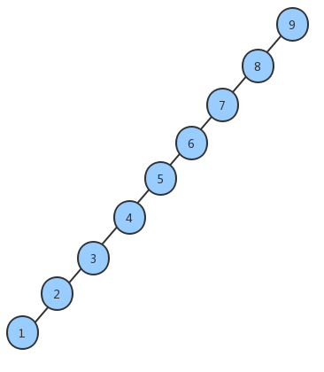

我们会发现，如果我们要查找1这个元素，查找的效率依旧会很低。效率低的原因在于这个树并不平衡，全部是向左边分支，如果我们有一种方法，能够不受插入数据的影响，让生成的树都像完全二叉树那样，那么即使在最坏情况下，查找的效率依旧会很好。

## 1.1 2-3查找树

为了保证查找树的平衡性，我们需要一些灵活性，因此在这里我们允许树中的一个结点保存多个键。确切的说，我们将一棵标准的二叉查找树中的结点称为2-结点(含有一个键和两条链)，而现在我们引入3-结点，它含有两个键和三条链。2-结点和3-结点中的每条链都对应着其中保存的键所分割产生的一个区间。

### 1.1.1 2-3查找树的定义

一棵2-3查找树要么为空，要么满足满足下面两个要求：

- **2-结点：**

  ​	含有一个键(及其对应的值)和两条链，左链接指向2-3树中的键都小于该结点，右链接指向的2-3树中的键都大于该结点。

- **3-结点：**

  ​	含有两个键(及其对应的值)和三条链，左链接指向的2-3树中的键都小于该结点，中链接指向的2-3树中的键都位于该结点的两个键之间，右链接指向的2-3树中的键都大于该结点。

示意图.png)

### 1.1.2 查找

将二叉查找树的查找算法一般化我们就能够直接得到2-3树的查找算法。要判断一个键是否在树中，我们先将它和根结点中的键比较。如果它和其中任意一个相等，查找命中；否则我们就根据比较的结果找到指向相应区间的连接，并在其指向的子树中递归地继续查找。如果这个是空链接，查找未命中。

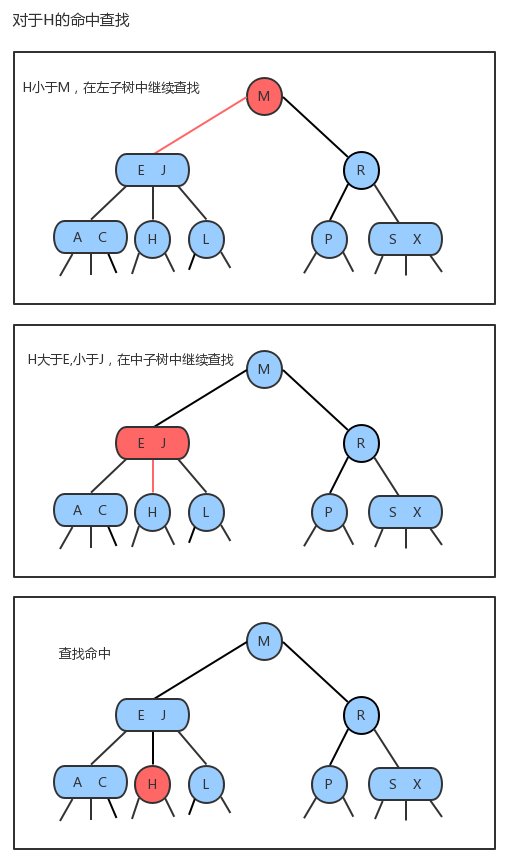

### 1.1.3 插入

#### 1.1.3.1 向2-结点中插入新键

往2-3树中插入元素和往二叉查找树中插入元素一样，首先要进行查找，然后将节点挂到未找到的节点上。2-3树之所以能够保证在最差的情况下的效率的原因在于其插入之后仍然能够保持平衡状态。如果查找后未找到的节点是一个2-结点，那么很容易，我们只需要将新的元素放到这个2-结点里面使其变成一个3-结点即可。但是如果查找的节点结束于一个3-结点，那么可能有点麻烦。 


#### 1.1.3.2  向一棵只含有一个3-结点的树中插入新键

假设2-3树只包含一个3-结点，这个结点有两个键，没有空间来插入第三个键了，最自然的方式是我们假设这个结点能存放三个元素，暂时使其变成一个4-结点，同时他包含四条链接。然后，我们将这个4-结点的中间元素提升，左边的键作为其左子结点，右边的键作为其右子结点。插入完成，变为平衡2-3查找树，树的高度从0变为1。


 

#### 1.1.3.3 向一个父结点为2-结点的3-结点中插入新键

和上面的情况一样一样，我们也可以将新的元素插入到3-结点中，使其成为一个临时的4-结点，然后，将该结点中的中间元素提升到父结点即2-结点中，使其父结点成为一个3-结点，然后将左右结点分别挂在这个3-结点的恰当位置。 

3.png)、


#### 1.3.1.4 向一个父结点为3-结点的3-结点中插入新键

当我们插入的结点是3-结点的时候，我们将该结点拆分，中间元素提升至父结点，但是此时父结点是一个3-结点，插入之后，父结点变成了4-结点，然后继续将中间元素提升至其父结点，直至遇到一个父结点是2-结点，然后将其变为3-结点，不需要继续进行拆分。 

4.png)

#### 1.3.1.5 分解根结点

当插入结点到根结点的路径上全部是3-结点的时候，最终我们的根结点会编程一个临时的4-结点，此时，就需要将根结点拆分为两个2-结点，树的高度加1。

5.png)

### 1.3.4 2-3树的性质

通过对2-3树插入操作的分析，我们发现在插入的时候，2-3树需要做一些局部的变换来保持2-3树的平衡。

一棵完全平衡的2-3树具有以下性质：

   1.任意空链接到根结点的路径长度都是相等的。

   	2. 4-结点变换为3-结点时，树的高度不会发生变化，只有当根结点是临时的4-结点，分解根结点时，树高+1。
     3.  2-3树与普通二叉查找树最大的区别在于，普通的二叉查找树是自顶向下生长，而2-3树是自底向上生长。

### 1.3.5 2-3树的实现

直接实现2-3树比较复杂，因为：

- ​	需要处理不同的结点类型，非常繁琐；
	 ​	需要多次比较操作来将结点下移；
	   	需要上移来拆分4-结点；
	  	 拆分4-结点的情况有很多种；

2-3查找树实现起来比较复杂，在某些情况插入后的平衡操作可能会使得效率降低。但是2-3查找树作为一种比较重要的概念和思路对于我们后面要讲到的红黑树、B树和B+树非常重要。

## 1.2 红黑树

我们前面介绍了2-3树，可以看到2-3树能保证在插入元素之后，树依然保持平衡状态，它的最坏情况下所有子结点都是2-结点，树的高度为lgN,相比于我们普通的二叉查找树，最坏情况下树的高度为N，确实保证了最坏情况下的时间复杂度，但是2-3树实现起来过于复杂，所以我们介绍一种2-3树思想的简单实现：红黑树。

红黑树主要是对2-3树进行编码，红黑树背后的基本思想是用标准的二叉查找树(完全由2-结点构成)和一些额外的信息(替换3-结点)来表示2-3树。我们将树中的链接分为两种类型：

​	**红链接：**将两个2-结点连接起来构成一个3-结点；
	**黑链接：**则是2-3树中的普通链接。

确切的说，我们将3-结点表示为由由一条**左斜**的红色链接(两个2-结点其中之一是另一个的左子结点)相连的两个2-结点。这种表示法的一个优点是，我们无需修改就可以直接使用标准的二叉查找树的get方法。

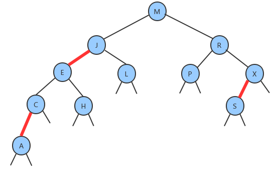

### 1.2.1 红黑树的定义

红黑树是含有红黑链接并满足下列条件的二叉查找树：

1. 红链接均为左链接；
2. 没有任何一个结点同时和两条红链接相连；
3. 该树是完美黑色平衡的，即任意空链接到根结点的路径上的黑链接数量相同；

下面是红黑树与2-3树的对应关系：

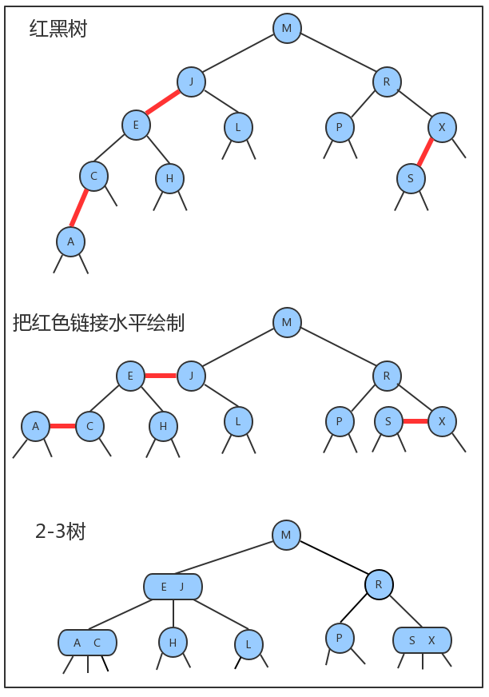

### 1.2.2 红黑树结点API

因为每个结点都只会有一条指向自己的链接（从它的父结点指向它），我们可以在之前的Node结点中添加一个布尔类型的变量color来表示链接的颜色。如果指向它的链接是红色的，那么该变量的值为true，如果链接是黑色的，那么该变量的值为false。

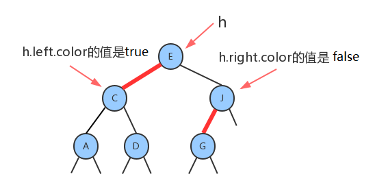

**API设计：**

| 类名     | Node<Key,Value>                                              |
| -------- | ------------------------------------------------------------ |
| 构造方法 | Node(Key key, Value value, Node left, Node right，boolean color)：创建Node对象 |
| 成员变量 | 1.public Node left:记录左子结点<br />2.public Node right:记录右子结点<br/>3.public Key key:存储键<br/>4.public Value value:存储值<br/>5.public boolean color:由其父结点指向它的链接的颜色 |

**代码：**

```java
private class Node<Key,Value>{
     //存储键
     public Key key;
     //存储值
     private Value value;
     //记录左子结点
     public Node left;
     //记录右子结点
     public Node right;
     //由其父结点指向它的链接的颜色
     public boolean color;

     public Node(Key key, Value value, Node left,Node right,boolean color) {
         this.key = key;
         this.value = value;
         this.left = left;
         this.right = right;
         this.color = color;
     }
 }
```

### 1.2.3 平衡化

在对红黑树进行一些增删改查的操作后，很有可能会出现红色的右链接或者两条连续红色的链接，而这些都不满足红黑树的定义，所以我们需要对这些情况通过旋转进行修复，让红黑树保持平衡。

#### 1.2.3.1 左旋

当某个结点的左子结点为黑色，右子结点为红色，此时需要左旋。

**前提：**当前结点为h，它的右子结点为x；

**左旋过程：**

​	1.让x的左子结点变为h的右子结点：h.right=x.left;

​	2.让h成为x的左子结点：x.left=h;

​	3.让h的color属性变为x的color属性值：x.color=h.color;

​	4.让h的color属性变为RED：h.color=true;

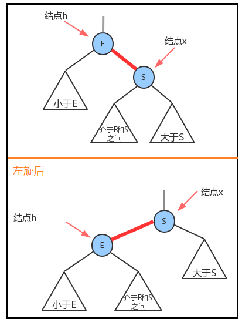

#### 1.2.3.2 右旋

当某个结点的左子结点是红色，且左子结点的左子结点也是红色，需要右旋

**前提：**当前结点为h，它的左子结点为x；

**右旋过程：**

​	1. 让x的右子结点成为h的左子结点：h.left = x.right;

​	2. 让h成为x的右子结点：x.right=h;

​        3. 让x的color变为h的color属性值：x.color = h.color;

​	4. 让h的color为RED；

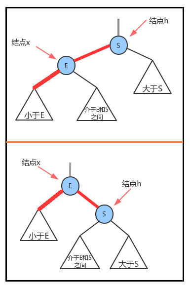

### 1.2.4 向单个2-结点中插入新键

一棵只含有一个键的红黑树只含有一个2-结点。插入另一个键后，我们马上就需要将他们旋转。

- 如果新键小于当前结点的键，我们只需要新增一个红色结点即可，新的红黑树和单个3-结点完全等价。

  .png)

- 如果新键大于当前结点的键，那么新增的红色结点将会产生一条红色的右链接，此时我们需要通过左旋，把红色右链接变成左链接，插入操作才算完成。形成的新的红黑树依然和3-结点等价，其中含有两个键，一条红色链接。

  .png)

  

### 1.2.5 向底部的2-结点插入新键

用和二叉查找树相同的方式向一棵红黑树中插入一个新键，会在树的底部新增一个结点（可以保证有序性），唯一区别的地方是我们会用红链接将新结点和它的父结点相连。如果它的父结点是一个2-结点，那么刚才讨论的两种方式仍然适用。

.png)

### 1.2.6 颜色反转

当一个结点的左子结点和右子结点的color都为RED时，也就是出现了临时的4-结点，此时只需要把左子结点和右子结点的颜色变为BLACK，同时让当前结点的颜色变为RED即可。

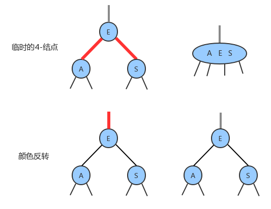


### 1.2.7 向一棵双键树(即一个3-结点)中插入新键

这种情况有可以分为三种子情况：

1. 新键大于原树中的两个键

   .png)

2. 新键小于原树中的两个键

   .png)

3. 新键介于原数中两个键之间

   .png)

### 1.2.8 根结点的颜色总是黑色

之前我们介绍结点API的时候，在结点Node对象中color属性表示的是父结点指向当前结点的连接的颜色，由于根结点不存在父结点，所以每次插入操作后，我们都需要把根结点的颜色设置为黑色。

### 1.2.9 向树底部的3-结点插入新键

假设在树的底部的一个3-结点下加入一个新的结点。前面我们所讲的3种情况都会出现。指向新结点的链接可能是3-结点的右链接（此时我们只需要转换颜色即可），或是左链接(此时我们需要进行右旋转然后再转换)，或是中链接(此时需要先左旋转然后再右旋转，最后转换颜色)。颜色转换会使中间结点的颜色变红，相当于将它送入了父结点。这意味着父结点中继续插入一个新键，我们只需要使用相同的方法解决即可，直到遇到一个2-结点或者根结点为止。

.png)

### 1.2.10 红黑树的API设计

| 类名     | RedBlackTree<Key extends Comparable<Key>, Value>             |
| -------- | ------------------------------------------------------------ |
| 构造方法 | RedBlackTree()：创建RedBlackTree对象                         |
| 成员方法 | 1.private boolean isRed(Node x)：判断当前结点的父指向链接是否为红色<br />2.private Node rotateLeft(Node h):左旋调整<br />3.private Node rotateRight(Node h):右旋调整<br />4.private void flipColors(Node h)：颜色反转,相当于完成拆分4-结点<br />5.public void put(Key key, Value val):在整个树上完成插入操作<br />6.private Node put(Node h, Key key, Value val):在指定树中，完成插入操作,并返回添加元素后新的树<br/>7.public Value get(Key key):根据key，从树中找出对应的值<br/>8.private Value get(Node x, Key key):从指定的树x中，找出key对应的值<br/>9.public int size():获取树中元素的个数 |
| 成员变量 | 1.private Node root : 记录根结点<br/>2.private int N:记录树中元素的个数<br/>3.private static final boolean RED：红色链接标识<br/>4.private static final boolean BLACK:黑色链接标识 |

### 1.2.11 红黑树的实现

```java
//红黑树代码
public class RedBlackTree<Key extends Comparable<Key>, Value> {
    //根节点
    private Node root;
    //记录树中元素的个数
    private int N;
    //红色链接
    private static final boolean RED = true;
    //黑色链接
    private static final boolean BLACK = false;


    /**
     * 判断当前节点的父指向链接是否为红色
     *
     * @param x
     * @return
     */
    private boolean isRed(Node x) {
        //空结点默认是黑色链接
        if (x == null) {
            return false;
        }
        //非空结点需要判断结点color属性的值
        return x.color == RED;
    }

    /**
     * 左旋转
     *
     * @param h
     * @return
     */
    private Node rotateLeft(Node h) {
        //找出当前结点h的右子结点
        Node hRight = h.right;
        //找出右子结点的左子结点
        Node lhRight = hRight.left;
        //让当前结点h的右子结点的左子结点成为当前结点的右子结点
        h.right = lhRight;
        //让当前结点h称为右子结点的左子结点
        hRight.left = h;
        //让当前结点h的color编程右子结点的color
        hRight.color = h.color;
        //让当前结点h的color变为RED
        h.color = RED;
        //返回当前结点的右子结点
        return hRight;
    }

    /**
     * 右旋
     *
     * @param h
     * @return
     */
    private Node rotateRight(Node h) {
        //找出当前结点h的左子结点
        Node hLeft = h.left;
        //找出当前结点h的左子结点的右子结点
        Node rHleft = hLeft.right;
        //让当前结点h的左子结点的右子结点称为当前结点的左子结点
        h.left = rHleft;
        //让当前结点称为左子结点的右子结点
        hLeft.right = h;
        //让当前结点h的color值称为左子结点的color值
        hLeft.color = h.color;
        //让当前结点h的color变为RED
        h.color = RED;
        //返回当前结点的左子结点
        return hLeft;
    }

    /**
     * 颜色反转,相当于完成拆分4-节点
     *
     * @param h
     */
    private void flipColors(Node h) {
        //当前结点的color属性值变为RED；
        h.color = RED;
        //当前结点的左右子结点的color属性值都变为黑色
        h.left.color = BLACK;
        h.right.color = BLACK;
    }

    /**
     * 在整个树上完成插入操作
     *
     * @param key
     * @param val
     */
    public void put(Key key, Value val) {
        //在root整个树上插入key-val
        root = put(root, key, val);
        //让根结点的颜色变为BLACK
        root.color = BLACK;
    }

    /**
     * 在指定树中，完成插入操作,并返回添加元素后新的树
     *
     * @param h
     * @param key
     * @param val
     */
    private Node put(Node h, Key key, Value val) {
        if (h == null) {
            //标准的插入操作，和父结点用红链接相连
            N++;
            return new Node(key, val, null, null, RED);
        }

        //比较要插入的键和当前结点的键
        int cmp = key.compareTo(h.key);
        if (cmp < 0) {
            //继续寻找左子树插入
            h.left = put(h.left, key, val);
        } else if (cmp > 0) {
            //继续寻找右子树插入
            h.right = put(h.right, key, val);
        } else {
            //已经有相同的结点存在，修改节点的值；
            h.value = val;
        }

        //如果当前结点的右链接是红色，左链接是黑色，需要左旋
        if (isRed(h.right) && !isRed(h.left)) {
            h=rotateLeft(h);
        }

        //如果当前结点的左子结点和左子结点的左子结点都是红色链接，则需要右旋
        if (isRed(h.left) && isRed(h.left.left)) {
            h=rotateRight(h);
        }

        //如果当前结点的左链接和右链接都是红色，需要颜色变换
        if (isRed(h.left) && isRed(h.right)) {
            flipColors(h);
        }
        //返回当前结点
        return h;
    }

    //根据key，从树中找出对应的值
    public Value get(Key key) {
        return get(root, key);
    }

    //从指定的树x中，查找key对应的值
    public Value get(Node x, Key key) {
        //如果当前结点为空，则没有找到,返回null
        if (x == null) {
            return null;
        }

        //比较当前结点的键和key
        int cmp = key.compareTo(x.key);
        if (cmp < 0) {
            //如果要查询的key小于当前结点的key，则继续找当前结点的左子结点；
            return get(x.left, key);
        } else if (cmp > 0) {
            //如果要查询的key大于当前结点的key，则继续找当前结点的右子结点；
            return get(x.right, key);
        } else {
            //如果要查询的key等于当前结点的key，则树中返回当前结点的value。
            return x.value;
        }

    }

    //获取树中元素的个数
    public int size() {
        return N;
    }

    //结点类
    private class Node {
        //存储键
        public Key key;
        //存储值
        private Value value;
        //记录左子结点
        public Node left;
        //记录右子结点
        public Node right;
        //由其父结点指向它的链接的颜色
        public boolean color;

        public Node(Key key, Value value, Node left, Node right, boolean color) {
            this.key = key;
            this.value = value;
            this.left = left;
            this.right = right;
            this.color = color;
        }
    }
}

//测试代码
public class Test {
    public static void main(String[] args) throws Exception {
        RedBlackTree<Integer, String> bt = new RedBlackTree<>();
        bt.put(4, "二哈");
        bt.put(1, "张三");
        bt.put(3, "李四");
        bt.put(5, "王五");
        System.out.println(bt.size());
        bt.put(1,"老三");
        System.out.println(bt.get(1));
        System.out.println(bt.size());
    }
}
```
# 二、B-树

前面我们已经学习了二叉查找树、2-3树以及它的实现红黑树。2-3树中，一个结点做多能有两个key，它的实现红黑树中使用对链接染色的方式去表达这两个key。接下来我们学习另外一种树型结构B树，这种数据结构中，一个结点允许多于两个key的存在。

B树是一种树状数据结构，它能够存储数据、对其进行排序并允许以O(logn)的时间复杂度进行查找、顺序读取、插入和删除等操作。

## 1.1 B树的特性

B树中允许一个结点中包含多个key，可以是3个、4个、5个甚至更多，并不确定，需要看具体的实现。现在我们选择一个参数M，来构造一个B树，我们可以把它称作是M阶的B树，那么该树会具有如下特点：

- 每个结点最多有M-1个key，并且以升序排列；
- 每个结点最多能有M个子结点；
- 根结点至少有两个子结点；


在实际应用中B树的阶数一般都比较大（通常大于100），所以，即使存储大量的数据，B树的高度仍然比较小，这样在某些应用场景下，就可以体现出它的优势。

## 2.2 B树存储数据

若参数M选择为5，那么每个结点最多包含4个键值对，我们以5阶B树为例，看看B树的数据存储。

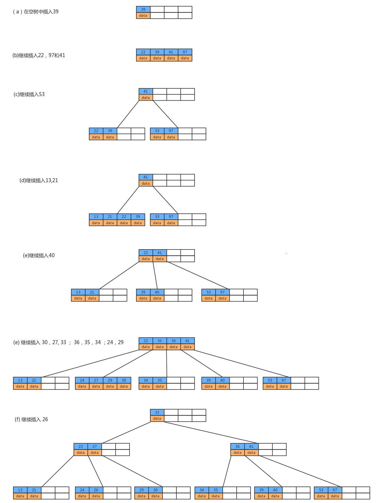

## 2.3 B树在磁盘文件中的应用

在我们的程序中，不可避免的需要通过IO操作文件，而我们的文件是存储在磁盘上的。计算机操作磁盘上的文件是通过文件系统进行操作的，在文件系统中就使用到了B树这种数据结构。

### 2.3.1 磁盘

磁盘能够保存大量的数据，从GB一直到TB级，但是 他的读取速度比较慢，因为涉及到机器操作，读取速度为毫秒级 。

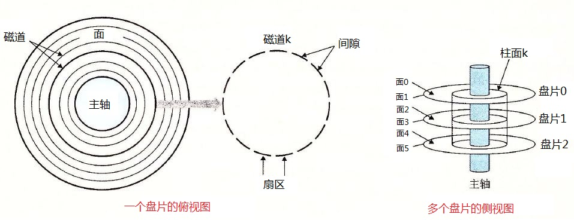

磁盘由盘片构成,每个盘片有两面，又称为盘面 。盘片中央有一个可以旋转的主轴，他使得盘片以固定的旋转速率旋转，通常是5400rpm或者是7200rpm,一个磁盘中包含了多个这样的盘片并封装在一个密封的容器内 。盘片的每个表面是由一组称为磁道同心圆组成的 ，每个磁道被划分为了一组扇区 ，每个扇区包含相等数量的数据位，通常是512个子节，扇区之间由一些间隙隔开,这些间隙中不存储数据 。

### 2.3.2 磁盘IO

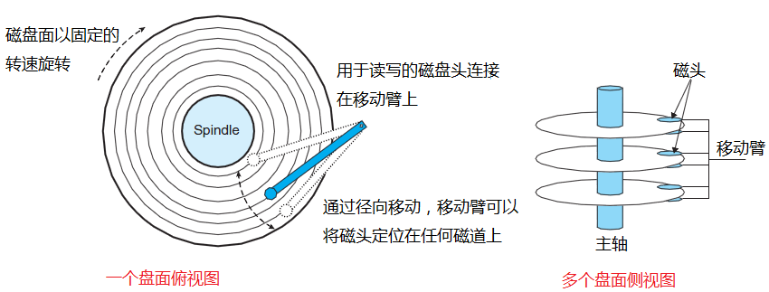

磁盘用磁头来读写存储在盘片表面的位，而磁头连接到一个移动臂上，移动臂沿着盘片半径前后移动，可以将磁头定位到任何磁道上，这称之为寻道操作。一旦定位到磁道后，盘片转动，磁道上的每个位经过磁头时，读写磁头就可以感知到该位的值，也可以修改值。对磁盘的访问时间分为 **寻道时间**，**旋转时间**，以及**传送时间**。 

由于存储介质的特性，磁盘本身存取就比主存慢很多，再加上机械运动耗费，因此为了提高效率，要尽量减少磁盘I/O，减少读写操作。 为了达到这个目的，磁盘往往不是严格按需读取，而是每次都会预读，即使只需要一个字节，磁盘也会从这个位置开始，顺序向后读取一定长度的数据放入内存。这样做的理论依据是计算机科学中著名的局部性原理：当一个数据被用到时，其附近的数据也通常会马上被使用。由于磁盘顺序读取的效率很高（不需要寻道时间，只需很少的旋转时间），因此预读可以提高I/O效率。 

页是计算机管理存储器的逻辑块，硬件及操作系统往往将主存和磁盘存储区分割为连续的大小相等的块，每个存储块称为一页（1024个字节或其整数倍），预读的长度一般为页的整倍数。主存和磁盘以页为单位交换数据。当程序要读取的数据不在主存中时，会触发一个缺页异常，此时系统会向磁盘发出读盘信号，磁盘会找到数据的起始位置并向后连续读取一页或几页载入内存中，然后异常返回，程序继续运行。 

文件系统的设计者利用了磁盘预读原理，将一个结点的大小设为等于一个页（1024个字节或其整数倍），这样每个结点只需要一次I/O就可以完全载入。那么3层的B树可以容纳1024\*1024\*1024差不多10亿个数据，如果换成二叉查找树，则需要30层！假定操作系统一次读取一个节点，并且根节点保留在内存中，那么B树在10亿个数据中查找目标值，只需要小于3次硬盘读取就可以找到目标值，但红黑树需要小于30次，因此B树大大提高了IO的操作效率。

# 三、 B+树

B+树是对B树的一种变形树，它与B树的差异在于：

1. 非叶结点仅具有索引作用，也就是说，非叶子结点只存储key，不存储value；
2. 树的所有叶结点构成一个有序链表，可以按照key排序的次序遍历全部数据。

## 2.1 B+树存储数据

若参数M选择为5，那么每个结点最多包含4个键值对，我们以5阶B+树为例，看看B+树的数据存储。

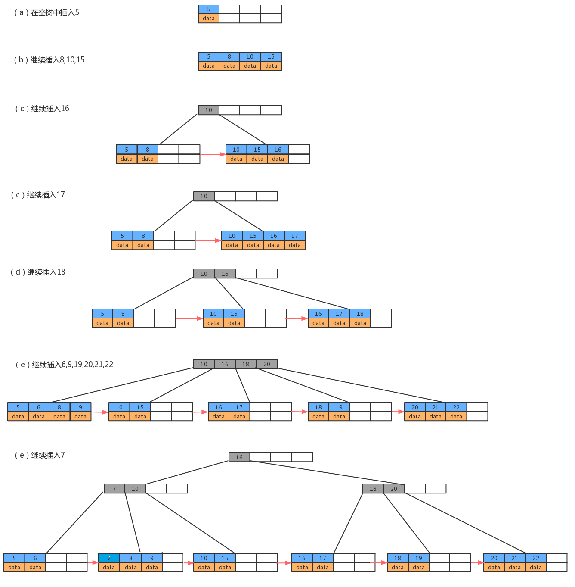

## 2.2 B+树和B树的对比

**B+ 树的优点在于：**

1.由于B+树在非叶子结点上不包含真正的数据，只当做索引使用，因此在内存相同的情况下，能够存放更多的key。 
2.B+树的叶子结点都是相连的，因此对整棵树的遍历只需要一次线性遍历叶子结点即可。而且由于数据顺序排列并且相连，所以便于区间查找和搜索。而B树则需要进行每一层的递归遍历。

**B树的优点在于：**

由于B树的每一个节点都包含key和value，因此我们根据key查找value时，只需要找到key所在的位置，就能找到value，但B+树只有叶子结点存储数据，索引每一次查找，都必须一次一次，一直找到树的最大深度处，也就是叶子结点的深度，才能找到value。

## 3.3 B+树在数据库中的应用

在数据库的操作中，查询操作可以说是最频繁的一种操作，因此在设计数据库时，必须要考虑到查询的效率问题，在很多数据库中，都是用到了B+树来提高查询的效率；

在操作数据库时，我们为了提高查询效率，可以基于某张表的某个字段建立索引，就可以提高查询效率，那其实这个索引就是B+树这种数据结构实现的。

### 3.3.1 未建立主键索引查询


执行`select * from user where id=18 `,需要从第一条数据开始，一直查询到第6条，发现id=18，此时才能查询出目标结果，共需要比较6次；

### 3.3.2 建立主键索引查询

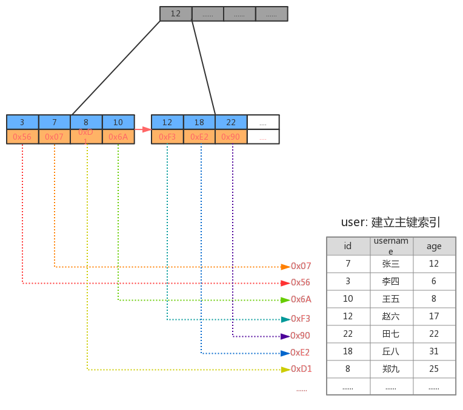

### 3.3.3 区间查询

执行`select * from user where id>=12 and id<=18`,如果有了索引，由于B+树的叶子结点形成了一个有序链表，所以我们只需要找到id为12的叶子结点，按照遍历链表的方式顺序往后查即可，效率非常高。